# 1. Model Evaluation


```python
import sys
sys.path.append("../dataset/")

import json
import matplotlib.pyplot as plt
import numpy as np
import tensorflow as tf

from keras_unet_collection import losses


from sklearn.metrics import confusion_matrix
import seaborn as sns
from sklearn.metrics import confusion_matrix
from skimage.measure import label, regionprops
import matplotlib.colors as mcolors

from utils import *
```


```python
batch_size = 8
nfold = 4
fold_id = 0
image_shape = (320, 320, 1)
augment = False

train_samsung_gen, val_samsung_gen, test_samsung_gen = get_dataset('samsung', batch_size, image_shape, augment, nfold=nfold, fold_id=fold_id)
train_ge_gen, val_ge_gen, test_ge_gen = get_dataset('ge', batch_size, image_shape, augment, nfold=nfold, fold_id=fold_id)
```

    Loading images from NRRD format and resizing
    Finished loading
    Loading images from NRRD format and resizing
    Finished loading
    Loading images from NRRD format and resizing
    Finished loading
    Loading images from NRRD format and resizing
    Finished loading
    Loading images from NRRD format and resizing
    Finished loading
    Loading images from NRRD format and resizing
    Finished loading


```python
train_mix_gen, val_mix_gen, test_mix_gen = get_dataset('mix', batch_size, image_shape, augment, nfold=nfold, fold_id=fold_id)
```

    Loading images from NRRD format and resizing
    Finished loading
    Loading images from NRRD format and resizing
    Finished loading
    Loading images from NRRD format and resizing
    Finished loading


```python
original_map = mcolors.LinearSegmentedColormap.from_list('original_mask', [(0, (0,0,0,0)), (1, 'yellow')])
```


```python
samsung_images, samsung_masks = test_samsung_gen.__getitem__(0)
```


```python
plt.figure(figsize=(16, 8))

i=1
for image, mask in zip(samsung_images, samsung_masks):
    plt.subplot(2, 4, i)
    plt.imshow(image)
    # plt.imshow(mask, alpha=0.5, cmap=original_map)
    plt.title(str(i))
    if i == 8:
        break
    i += 1
# plt.suptitle("Title centered above all subplots", fontsize=14)
plt.show()
```


    
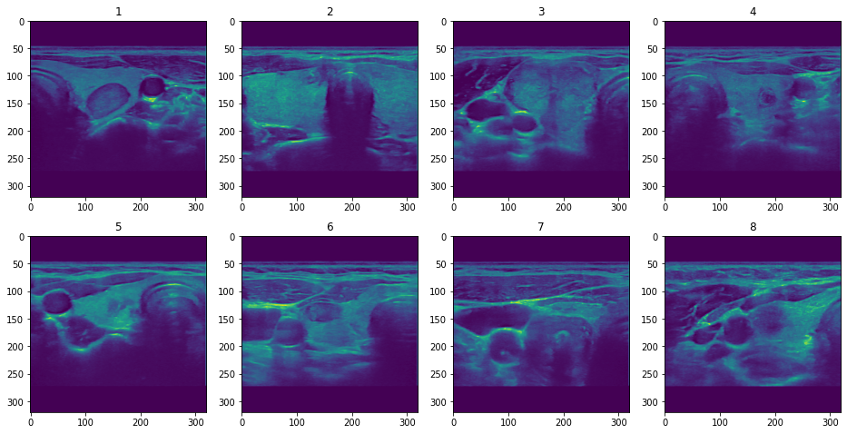
    


```python
ge_images, ge_masks = test_ge_gen.__getitem__(0)
```


```python
plt.figure(figsize=(16, 8))

i=1
for image, mask in zip(ge_images, ge_masks):
    plt.subplot(2, 4, i)
    plt.imshow(image)
    # plt.imshow(mask, alpha=0.5, cmap=original_map)
    plt.title(str(i))
    if i == 8:
        break
    i += 1
```


    
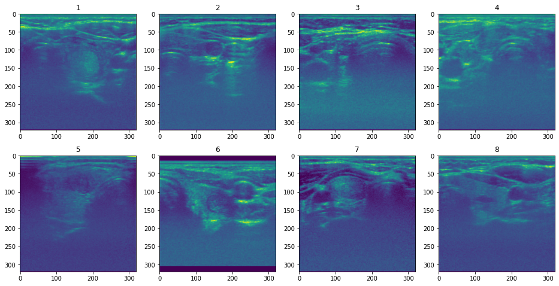
    


```python
import tensorflow.keras.backend as K

def custom_focal_tversky(y_true, y_pred, alpha=0.7, gamma=4/3):
    return losses.focal_tversky(y_true, y_pred, alpha=alpha, gamma=gamma)

custom_objects = {'custom_focal_tversky': custom_focal_tversky}

class ModelTester:
    
    def __init__(self, path_to_model, 
                 custom_objects, 
                 # ds,
                 images, 
                 masks,
                 batch_id=0,
                 filter_masks=False, 
                 from_checkpoint=False):
        
        self.path_to_model = path_to_model
        self.custom_objects = custom_objects
        self.base_path = f'output/{path_to_model}'
        self.model_name = self.base_path.split('/')[1]
        self.model_type = self.base_path.split('/')[3]
        if from_checkpoint:
            self.model_path = f'{self.base_path}checkpoint'
        else:
            self.model_path = f'{self.base_path}model/model'
        self.meta_path = f'{self.base_path}meta/'

        self.original_map = mcolors.LinearSegmentedColormap.from_list('original_mask', [(0, (0,0,0,0)), (1, 'yellow')])
        self.pred_map = mcolors.LinearSegmentedColormap.from_list('pred_mask', [(0, (0,0,0,0)), (1, 'red')])
        self.images, self.masks = images, masks
        
        gpus = tf.config.list_logical_devices('GPU')
        strategy = tf.distribute.MirroredStrategy(gpus)
        with strategy.scope():
            self.model = tf.keras.models.load_model(self.model_path, custom_objects=self.custom_objects)
            self.predictions = self.model.predict(self.images) # Mock predictions
            
        # print(model.summary())
            
        if filter_masks:
            self.filtered_predictions = []
            for pred in self.predictions:
                self.filtered_predictions.append(np.array(self.get_largest_mask(pred)))
                                                 
    def create_report(self, model_summary=False, custom_objects=None, plot_history=True, rm_small_masks=False):
        model_path = f'{self.base_path}model/model'
        meta_path = f'{self.base_path}meta/'
        
        if plot_history:
            self.history = json.load(open(self.meta_path+'history.json'))
            self.plot_history()
        self.plot_us_images(rm_small_masks)
        
        dice_value = self.dice_coef(self.masks, self.predictions)
        print(f'Dice coefficient={dice_value}')
        
        accuracy, precision, recall, f1 = self.basic_metrics(self.masks, self.predictions)
        print(f'accuracy={accuracy}, precision={precision}, recall={recall}, f1={f1}')
        
        loss_val = custom_focal_tversky(self.masks, self.predictions)
        print(f'loss={loss_val}')

        y_true = np.round(self.masks).astype(int).flatten()
        y_pred = np.round(self.predictions).astype(int).flatten()
        cmat = confusion_matrix(y_true, y_pred)
        self.plot_confusion_matrix(cmat)
        
        if model_summary:
            print(model.summary())
    
    
    def plot_us_images(self, rm_small_masks=False):
        cols = 3 if rm_small_masks else 2
        
        image_id = 0
        plt.figure(figsize=(18, 10))
        for i in range(0, 4):
            plt.subplot(cols, 4, i+1)
            plt.imshow(self.images[i])
            plt.imshow(self.masks[i], alpha=0.3, cmap=self.original_map)
            plt.title('Oryginalna maska')
            
            plt.subplot(cols, 4, i+5)
            plt.imshow(self.images[i])
            plt.imshow(self.predictions[i], alpha=0.3, cmap=self.pred_map)
            plt.title('Przewidywana maska')
            
            if rm_small_masks:
                plt.subplot(cols, 4, i+9)
                plt.imshow(self.images[i])
                large_mask = self.get_largest_mask(self.predictions[i])
                plt.imshow(large_mask, alpha=0.5)
                plt.title('Predicted without small masks')
            image_id += 1
        plt.show()

    
    def plot_history(self):
        # Extract the history values
        loss = self.history['loss']
        acc = self.history['accuracy']
        val_loss = self.history['val_loss']
        val_acc = self.history['val_accuracy']
        # mean_io_u = self.history['mean_io_u']
        # val_mean_io_u = self.history['val_mean_io_u']
        
        plt.figure(figsize=(18, 15))
        plt.subplot(3, 1, 1)
        plt.plot(loss)
        plt.plot(val_loss)
        plt.title('Loss')
        plt.xlabel('Epoch')
        plt.ylabel('Loss')
        plt.legend(['Training', 'Validation'])

        plt.subplot(3, 1, 2)
        plt.plot(acc)
        plt.plot(val_acc)
        plt.title('Accuracy')
        plt.xlabel('Epoch')
        plt.ylabel('Accuracy')
        plt.legend(['Training', 'Validation'])
        
        plt.show()
    
        
    def dice_coef(self, y_true, y_pred, smooth=100):        
        y_true_f = K.flatten(y_true)
        y_pred_f = K.flatten(y_pred)
        intersection = K.sum(y_true_f * y_pred_f)
        dice = (2. * intersection + smooth) / (K.sum(y_true_f) + K.sum(y_pred_f) + smooth)
        return dice
    
    
    def calculate_segmentation_metrics(self, y_true, y_pred):
        """
        Calculates TP, TN, FP, FN values for binary segmentation.
        """
        y_true = np.round(y_true).astype(int).flatten()
        y_pred = np.round(y_pred).astype(int).flatten()

        TP = np.sum((y_true == 1) & (y_pred == 1))
        TN = np.sum((y_true == 0) & (y_pred == 0))
        FP = np.sum((y_true == 0) & (y_pred == 1))
        FN = np.sum((y_true == 1) & (y_pred == 0))

        return TP, TN, FP, FN
    
    
    def basic_metrics(self, y_true, y_pred):
        TP, TN, FP, FN = self.calculate_segmentation_metrics(y_true, y_pred)
        
        accuracy = (TP + TN) / (TP + TN + FP + FN)
        precision = TP / (TP + FP)
        recall = TP / (TP + FN)
        f1 = 2 * precision * recall / (precision + recall)
        
        return accuracy, precision, recall, f1


    def plot_confusion_matrix(self, cmat):
        plt.figure(figsize = (6,6))
        labels = ['0', '1']
        annot = ['True Neg', 'False Pos', 'False Neg', 'True Pos']
        group_counts = ['{0:0.0f}'.format(value) for value in cmat.flatten()]
        annot = [f'{v1}\n{v2}' for v1, v2 in zip(annot, group_counts)]
        annot = np.asarray(annot).reshape(2,2)
        sns.heatmap(cmat, cmap='Blues', fmt='', xticklabels=labels, yticklabels=labels, annot=annot)

        plt.xlabel("predictions")
        plt.ylabel("real values")
        plt.show()
        
        
    def class_histogram(self):
        pass
    
        
    def mean_iou(self):
        
        return None
        

    def get_largest_mask(self, segmentation_output):
        labeled_output = label(segmentation_output)
        props = regionprops(labeled_output)
        largest_mask_index = np.argmax([prop.area for prop in props])
        largest_mask = labeled_output == (largest_mask_index + 1)
        return largest_mask
    
    
    @staticmethod
    def calculate_full_metrics():
        pass
        
# u2net_2d_tester = ModelTester('unet_2d/samsung/test/', val_gen, custom_objects)
# u2net_2d_tester.create_report(rm_small_masks=True)
```

## 1. Classic U-Net

For rerun 
Samsung
'unet_2d/samsung/320_nf4_fi3/'

GE
'unet_2d/ge/320_nf4_fi2/'

## 1.1. Samsung on Samsung


```python
u2net_2d_tester = ModelTester('unet_2d/samsung/320_nf4_fi3/', custom_objects, samsung_images, samsung_masks)
u2net_2d_tester.create_report(plot_history=True)
```

    WARNING:tensorflow:Collective ops is not configured at program startup. Some performance features may not be enabled.
    INFO:tensorflow:Using MirroredStrategy with devices ('/job:localhost/replica:0/task:0/device:GPU:0', '/job:localhost/replica:0/task:0/device:GPU:1', '/job:localhost/replica:0/task:0/device:GPU:2')


    
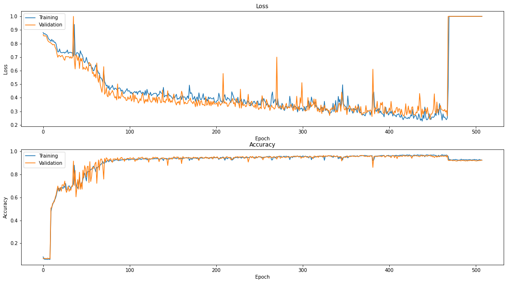
    


    

    


    Dice coefficient=0.8680596947669983
    accuracy=0.97763427734375, precision=0.8391287360812659, recall=0.8985059016883311, f1=0.8678028225922826
    loss=0.20392586290836334


    

    


## 1.2. GE on GE


```python
unet_2d_tester = ModelTester('unet_2d/ge/320_nf4_fi2/', custom_objects, ge_images, ge_masks)
unet_2d_tester.create_report(plot_history=True)
```

    WARNING:tensorflow:Collective ops is not configured at program startup. Some performance features may not be enabled.
    INFO:tensorflow:Using MirroredStrategy with devices ('/job:localhost/replica:0/task:0/device:GPU:0', '/job:localhost/replica:0/task:0/device:GPU:1', '/job:localhost/replica:0/task:0/device:GPU:2')


    
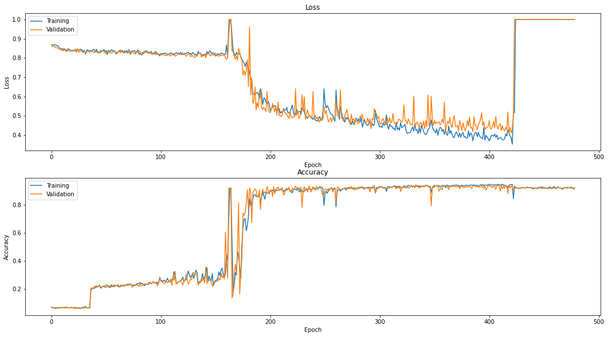
    


    
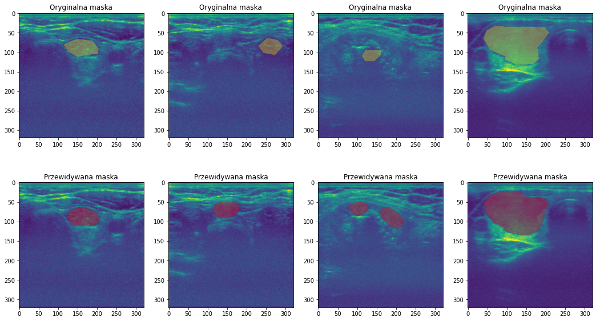
    


    Dice coefficient=0.6949803829193115
    accuracy=0.967244873046875, precision=0.5880118030510502, recall=0.8478587319243605, f1=0.6944232499345185
    loss=0.3548142611980438


    

    


## 1.3. Samsung on GE


```python
unet_2d_tester = ModelTester('unet_2d/samsung/320_nf4_fi0/', custom_objects, ge_images, ge_masks)
unet_2d_tester.create_report(plot_history=False)
```

    WARNING:tensorflow:Collective ops is not configured at program startup. Some performance features may not be enabled.
    INFO:tensorflow:Using MirroredStrategy with devices ('/job:localhost/replica:0/task:0/device:GPU:0', '/job:localhost/replica:0/task:0/device:GPU:1', '/job:localhost/replica:0/task:0/device:GPU:2')


    
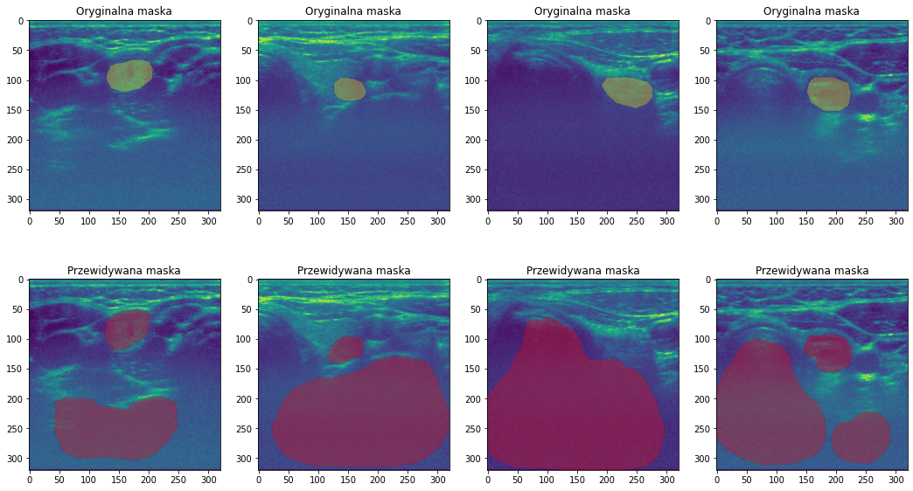
    


    Dice coefficient=0.11393407732248306
    accuracy=0.6583203125, precision=0.061414343242882606, recall=0.762953202703277, f1=0.11367810414054286
    loss=0.8677613139152527


    
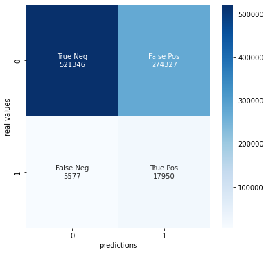
    


## 1.4. GE on Samsung


```python
unet_2d_tester = ModelTester('unet_2d/ge/320_nf4_fi0/', custom_objects, samsung_images, samsung_masks)
unet_2d_tester.create_report(plot_history=False)
```

    WARNING:tensorflow:Collective ops is not configured at program startup. Some performance features may not be enabled.
    INFO:tensorflow:Using MirroredStrategy with devices ('/job:localhost/replica:0/task:0/device:GPU:0', '/job:localhost/replica:0/task:0/device:GPU:1', '/job:localhost/replica:0/task:0/device:GPU:2')


    
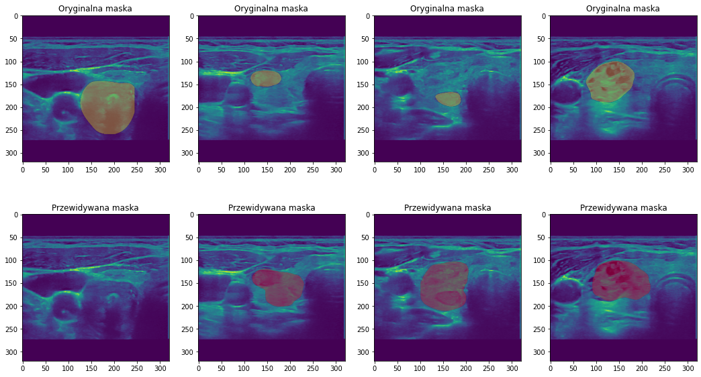
    


    Dice coefficient=0.5466128587722778
    accuracy=0.94544921875, precision=0.5793330890436057, recall=0.5163787969029184, f1=0.546047418784665
    loss=0.5640836358070374


    
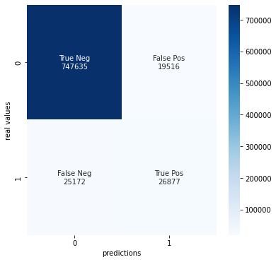
    


## 5.5. Mix on Samsung

Retrain 
All

Trained on stack_num_down=4, stack_num_up=4 instead of stack_num_down=3, stack_num_up=3
'unet_2d/mix/320_nf4_fi0/'
'unet_2d/mix/320_nf4_fi3/'


```python
unet_2d_tester = ModelTester('unet_2d/mix/320_nf4_fi0/', custom_objects, samsung_images, samsung_masks)
unet_2d_tester.create_report(plot_history=True)
```

    WARNING:tensorflow:Collective ops is not configured at program startup. Some performance features may not be enabled.
    INFO:tensorflow:Using MirroredStrategy with devices ('/job:localhost/replica:0/task:0/device:GPU:0', '/job:localhost/replica:0/task:0/device:GPU:1', '/job:localhost/replica:0/task:0/device:GPU:2')
    INFO:tensorflow:Reduce to /job:localhost/replica:0/task:0/device:CPU:0 then broadcast to ('/job:localhost/replica:0/task:0/device:CPU:0',).
    INFO:tensorflow:Reduce to /job:localhost/replica:0/task:0/device:CPU:0 then broadcast to ('/job:localhost/replica:0/task:0/device:CPU:0',).
    INFO:tensorflow:Reduce to /job:localhost/replica:0/task:0/device:CPU:0 then broadcast to ('/job:localhost/replica:0/task:0/device:CPU:0',).
    INFO:tensorflow:Reduce to /job:localhost/replica:0/task:0/device:CPU:0 then broadcast to ('/job:localhost/replica:0/task:0/device:CPU:0',).
    INFO:tensorflow:Reduce to /job:localhost/replica:0/task:0/device:CPU:0 then broadcast to ('/job:localhost/replica:0/task:0/device:CPU:0',).
    INFO:tensorflow:Reduce to /job:localhost/replica:0/task:0/device:CPU:0 then broadcast to ('/job:localhost/replica:0/task:0/device:CPU:0',).
    INFO:tensorflow:Reduce to /job:localhost/replica:0/task:0/device:CPU:0 then broadcast to ('/job:localhost/replica:0/task:0/device:CPU:0',).
    INFO:tensorflow:Reduce to /job:localhost/replica:0/task:0/device:CPU:0 then broadcast to ('/job:localhost/replica:0/task:0/device:CPU:0',).
    INFO:tensorflow:Reduce to /job:localhost/replica:0/task:0/device:CPU:0 then broadcast to ('/job:localhost/replica:0/task:0/device:CPU:0',).
    INFO:tensorflow:Reduce to /job:localhost/replica:0/task:0/device:CPU:0 then broadcast to ('/job:localhost/replica:0/task:0/device:CPU:0',).


    
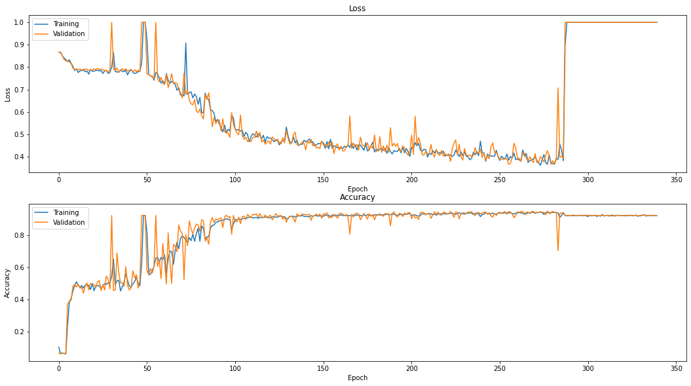
    


    
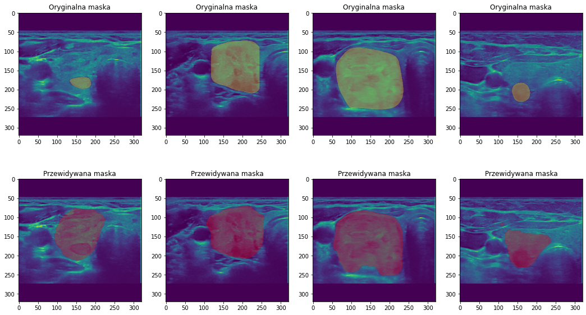
    


    Dice coefficient=0.719916582107544
    accuracy=0.93884765625, precision=0.575365770670296, recall=0.9600776931122068, f1=0.7195261236647034
    loss=0.2991807758808136


    

    


## 5.5. Mix on GE


```python

```

# 2. U^2-Net

## 2.1. Samsung

For rerun 
Samsung


```python
u2net_2d_tester = ModelTester('u2net_2d/samsung/320_nf4_fi0/', custom_objects, ds=test_samsung_gen, size=(320, 320))
u2net_2d_tester.create_report(plot_history=True)
```

    WARNING:tensorflow:Collective ops is not configured at program startup. Some performance features may not be enabled.
    INFO:tensorflow:Using MirroredStrategy with devices ('/job:localhost/replica:0/task:0/device:GPU:0', '/job:localhost/replica:0/task:0/device:GPU:1', '/job:localhost/replica:0/task:0/device:GPU:2')


    
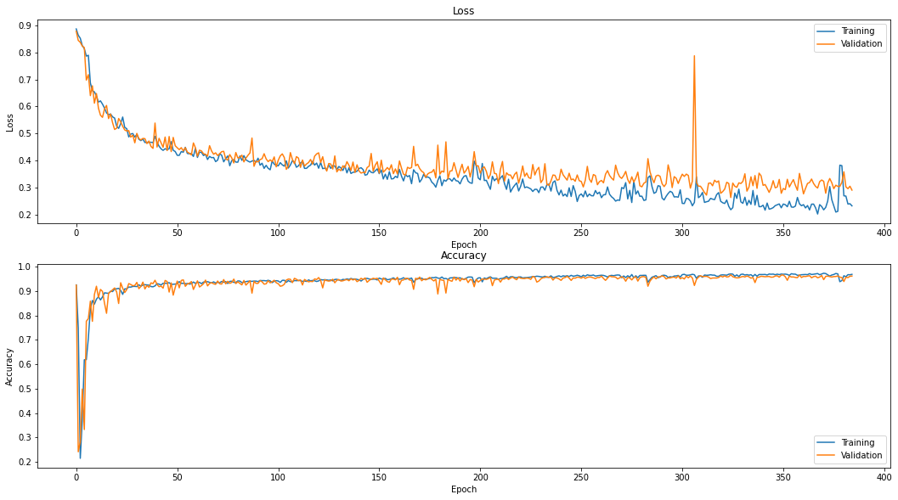
    


    
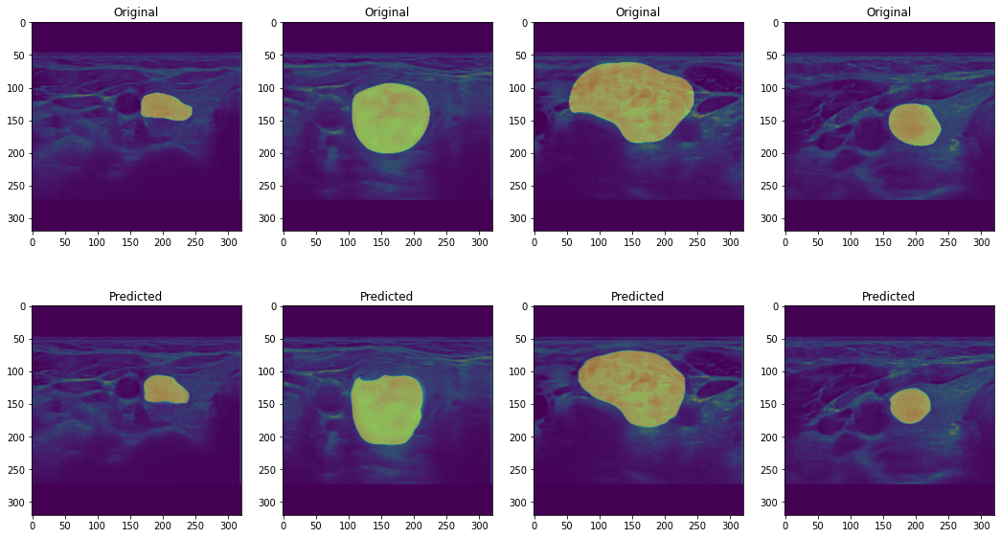
    


    Dice coefficient=0.864187479019165
    accuracy=0.982620849609375, precision=0.913004679939716, recall=0.823764112289993, f1=0.8660916675288518
    loss=0.24412938952445984


    

    


```python
u2net_2d_tester = ModelTester('u2net_2d/samsung/320_nf4_fi3/', custom_objects, ds=test_samsung_gen, size=(320, 320))
u2net_2d_tester.create_report(plot_history=True)
```

    WARNING:tensorflow:Collective ops is not configured at program startup. Some performance features may not be enabled.
    INFO:tensorflow:Using MirroredStrategy with devices ('/job:localhost/replica:0/task:0/device:GPU:0', '/job:localhost/replica:0/task:0/device:GPU:1', '/job:localhost/replica:0/task:0/device:GPU:2')


    
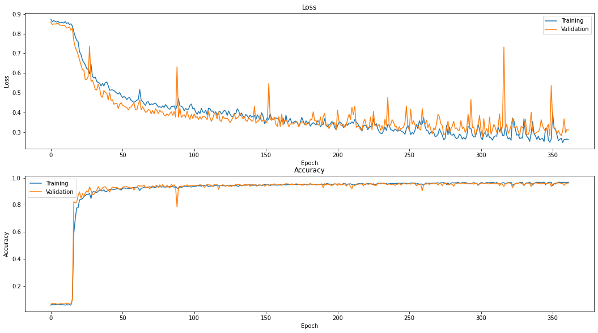
    


    

    


    Dice coefficient=0.8476685881614685
    accuracy=0.975244140625, precision=0.7784213850847367, recall=0.9385380713950059, f1=0.8510138113429327
    loss=0.20272256433963776


    

    


## 2.2 GE


```python
u2net_2d_tester = ModelTester('u2net_2d/ge/320_nf4_fi2/', custom_objects, ds=test_ge_gen, size=(320, 320), batch_id=1)
u2net_2d_tester.create_report(plot_history=True)
```

    WARNING:tensorflow:Collective ops is not configured at program startup. Some performance features may not be enabled.
    INFO:tensorflow:Using MirroredStrategy with devices ('/job:localhost/replica:0/task:0/device:GPU:0', '/job:localhost/replica:0/task:0/device:GPU:1', '/job:localhost/replica:0/task:0/device:GPU:2')


    
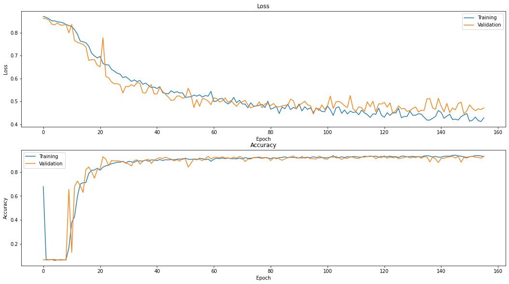
    


    

    


    Dice coefficient=0.6172356605529785
    accuracy=0.911033935546875, precision=0.7578125997726779, recall=0.5239369216641944, f1=0.6195375837209424
    loss=0.5250241756439209


    

    


## 2.3. Samsung on GE


```python
u2net_2d_tester = ModelTester('u2net_2d/samsung/320_nf4_fi1/', custom_objects, ds=test_ge_gen, size=(320, 320), batch_id=1)
u2net_2d_tester.create_report(plot_history=False)
```

    WARNING:tensorflow:Collective ops is not configured at program startup. Some performance features may not be enabled.
    INFO:tensorflow:Using MirroredStrategy with devices ('/job:localhost/replica:0/task:0/device:GPU:0', '/job:localhost/replica:0/task:0/device:GPU:1', '/job:localhost/replica:0/task:0/device:GPU:2')


    

    


    Dice coefficient=0.3906748294830322
    accuracy=0.605242919921875, precision=0.24764432488260654, recall=0.9103535353535354, f1=0.3893683993874518
    loss=0.5890365242958069


    

    


## 2.4. GE on Samsung


```python
u2net_2d_tester = ModelTester('u2net_2d/ge/320_nf4_fi2/', custom_objects, ds=test_samsung_gen, size=(320, 320))
u2net_2d_tester.create_report(plot_history=False)
```

    WARNING:tensorflow:Collective ops is not configured at program startup. Some performance features may not be enabled.
    INFO:tensorflow:Using MirroredStrategy with devices ('/job:localhost/replica:0/task:0/device:GPU:0', '/job:localhost/replica:0/task:0/device:GPU:1', '/job:localhost/replica:0/task:0/device:GPU:2')


    

    


    Dice coefficient=0.780373215675354
    accuracy=0.97041259765625, precision=0.7482614507368741, recall=0.8253177313700241, f1=0.7849029143445387
    loss=0.30533477663993835


    

    


## 2.5. Mix on Samsung

Retrain 

!!!!!!!!!!!!!!!!!!!!!!!!!!!!!!!!!!!!!!!!!!!!!!!
Retrained with stack_num_down=4, stack_num_up=4
!!!!!!!!!!!!!!!!!!!!!!!!!!!!!!!!!!!!!!!!!!!!!!!
'u2net_2d/mix/320_nf4_fi0/'
'u2net_2d/mix/320_nf4_fi3/'


```python
u2net_2d_tester = ModelTester('u2net_2d/mix/320_nf4_fi3/', custom_objects, samsung_images, samsung_masks)
u2net_2d_tester.create_report(plot_history=True)
```

    WARNING:tensorflow:Collective ops is not configured at program startup. Some performance features may not be enabled.
    INFO:tensorflow:Using MirroredStrategy with devices ('/job:localhost/replica:0/task:0/device:GPU:0', '/job:localhost/replica:0/task:0/device:GPU:1', '/job:localhost/replica:0/task:0/device:GPU:2')
    WARNING:tensorflow:6 out of the last 6 calls to <function Model.make_predict_function.<locals>.predict_function at 0x7f69683a8598> triggered tf.function retracing. Tracing is expensive and the excessive number of tracings could be due to (1) creating @tf.function repeatedly in a loop, (2) passing tensors with different shapes, (3) passing Python objects instead of tensors. For (1), please define your @tf.function outside of the loop. For (2), @tf.function has experimental_relax_shapes=True option that relaxes argument shapes that can avoid unnecessary retracing. For (3), please refer to https://www.tensorflow.org/guide/function#controlling_retracing and https://www.tensorflow.org/api_docs/python/tf/function for  more details.


    
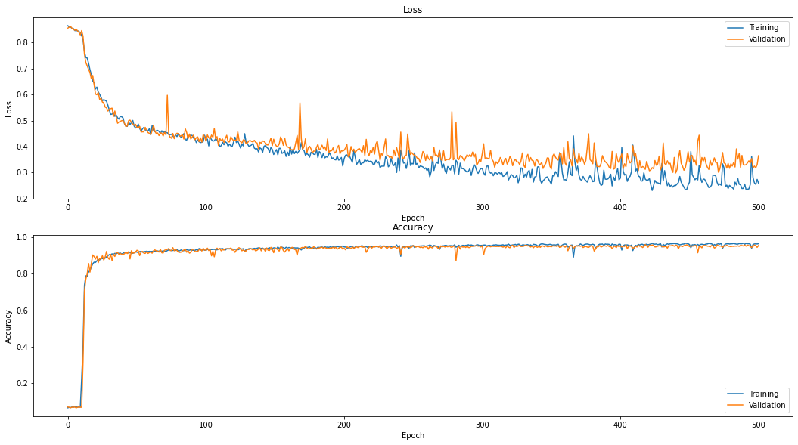
    


    

    


    Dice coefficient=0.7622494697570801
    accuracy=0.96321533203125, precision=0.802220908075432, recall=0.7296578514866279, f1=0.7642207721077259
    loss=0.3564944863319397


    
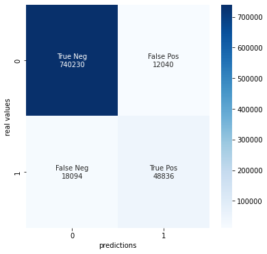
    


# 3. Unet-3D+

For rerun

Samsung


## 3.1. Samsung


```python
unet_3plus_2d_tester = ModelTester('unet_3plus_2d/samsung/320_nf4_fi1/', custom_objects=custom_objects, ds=test_samsung_gen, batch_id=1)
unet_3plus_2d_tester.create_report(plot_history=True)
```

    WARNING:tensorflow:Collective ops is not configured at program startup. Some performance features may not be enabled.
    INFO:tensorflow:Using MirroredStrategy with devices ('/job:localhost/replica:0/task:0/device:GPU:0', '/job:localhost/replica:0/task:0/device:GPU:1', '/job:localhost/replica:0/task:0/device:GPU:2')


    
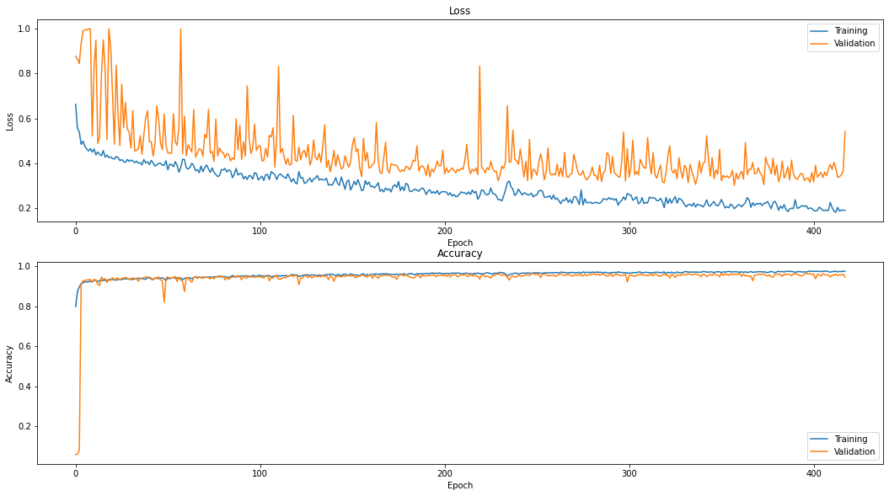
    


    

    


    Dice coefficient=0.6439123153686523
    accuracy=0.96372802734375, precision=0.7504122069138977, recall=0.5637031594415871, f1=0.6437939053921216
    loss=0.4945428669452667


    
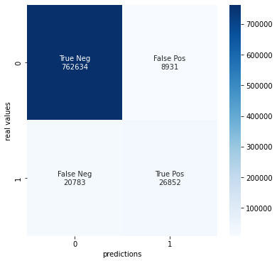
    


## 3.2. GE


```python
unet_3plus_2d_tester = ModelTester('unet_3plus_2d/ge/320_nf4_fi3/', custom_objects=custom_objects, ds=test_ge_gen, batch_id=1)
unet_3plus_2d_tester.create_report(plot_history=True)
```

    WARNING:tensorflow:Collective ops is not configured at program startup. Some performance features may not be enabled.
    INFO:tensorflow:Using MirroredStrategy with devices ('/job:localhost/replica:0/task:0/device:GPU:0', '/job:localhost/replica:0/task:0/device:GPU:1', '/job:localhost/replica:0/task:0/device:GPU:2')


    
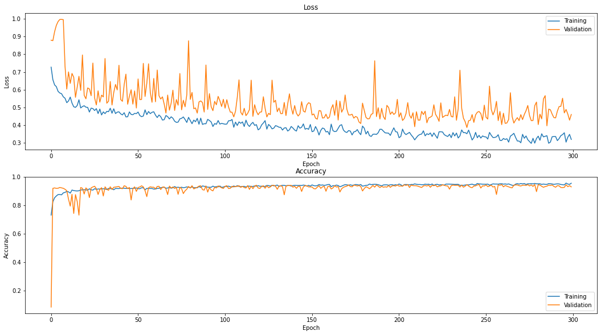
    


    

    


    Dice coefficient=0.8474569320678711
    accuracy=0.972708740234375, precision=0.840134395491248, recall=0.8545246592897794, f1=0.847268429645924
    loss=0.24080750346183777


    

    


## 3.3. Samsung on GE


```python
unet_3plus_2d_tester = ModelTester('unet_3plus_2d/samsung/320_nf4_fi0/', custom_objects=custom_objects, ds=test_ge_gen, batch_id=1)
unet_3plus_2d_tester.create_report(plot_history=False)
```

    WARNING:tensorflow:Collective ops is not configured at program startup. Some performance features may not be enabled.
    INFO:tensorflow:Using MirroredStrategy with devices ('/job:localhost/replica:0/task:0/device:GPU:0', '/job:localhost/replica:0/task:0/device:GPU:1', '/job:localhost/replica:0/task:0/device:GPU:2')


    
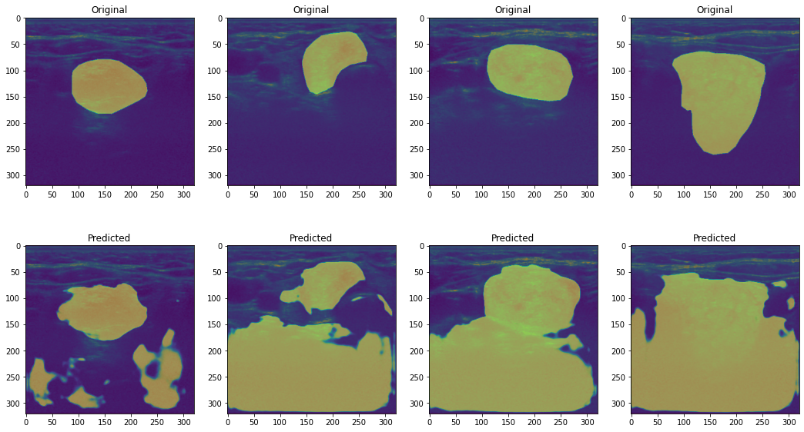
    


    Dice coefficient=0.34440407156944275
    accuracy=0.572071533203125, precision=0.2185278230484012, recall=0.8133608815426997, f1=0.34449835918436034
    loss=0.6409668922424316


    
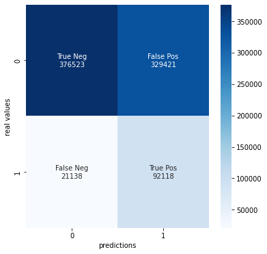
    


## 3.4. GE on Samsung


```python
unet_3plus_2d_tester = ModelTester('unet_3plus_2d/ge/320_nf4_fi0/', custom_objects=custom_objects, ds=test_samsung_gen, batch_id=1)
unet_3plus_2d_tester.create_report(plot_history=False)
```

    WARNING:tensorflow:Collective ops is not configured at program startup. Some performance features may not be enabled.
    INFO:tensorflow:Using MirroredStrategy with devices ('/job:localhost/replica:0/task:0/device:GPU:0', '/job:localhost/replica:0/task:0/device:GPU:1', '/job:localhost/replica:0/task:0/device:GPU:2')


    
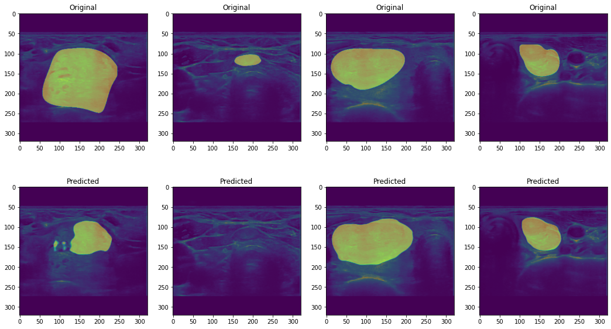
    


    Dice coefficient=0.6187209486961365
    accuracy=0.945159912109375, precision=0.6041919653996507, recall=0.6321973125391631, f1=0.6178774656153513
    loss=0.4801424741744995


    

    


## Mix


```python
unet_3plus_2d_tester = ModelTester('unet_3plus_2d/mix/320_nf4_fi1/', custom_objects, samsung_images, samsung_masks)
unet_3plus_2d_tester.create_report(plot_history=True)
```

    WARNING:tensorflow:Collective ops is not configured at program startup. Some performance features may not be enabled.
    INFO:tensorflow:Using MirroredStrategy with devices ('/job:localhost/replica:0/task:0/device:GPU:0', '/job:localhost/replica:0/task:0/device:GPU:1', '/job:localhost/replica:0/task:0/device:GPU:2')


    

    


    
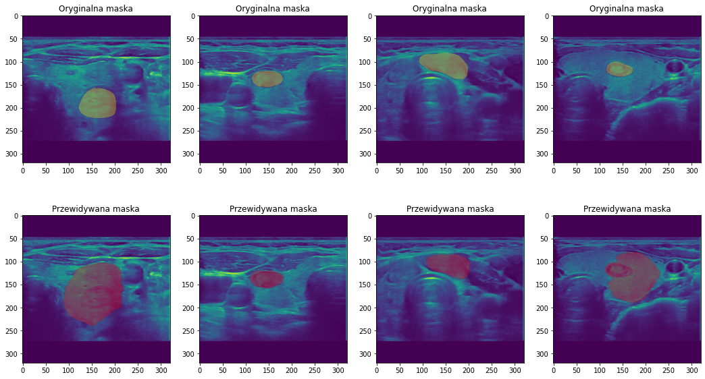
    


    Dice coefficient=0.6516767144203186
    accuracy=0.9642138671875, precision=0.49045076680521715, recall=0.9690265486725663, f1=0.6512739990007851
    loss=0.3540329337120056


    

    


# 4. Transunet

For rerun

'transunet_2d/samsung/320_nf4_fi1/'

## 4.1. Samsung


```python
transunet_2d_tester = ModelTester('transunet_2d/samsung/320_nf4_fi0/', custom_objects, samsung_images, samsung_masks)
transunet_2d_tester.create_report(plot_history=True)
```

    WARNING:tensorflow:Collective ops is not configured at program startup. Some performance features may not be enabled.
    INFO:tensorflow:Using MirroredStrategy with devices ('/job:localhost/replica:0/task:0/device:GPU:0', '/job:localhost/replica:0/task:0/device:GPU:1', '/job:localhost/replica:0/task:0/device:GPU:2')


    
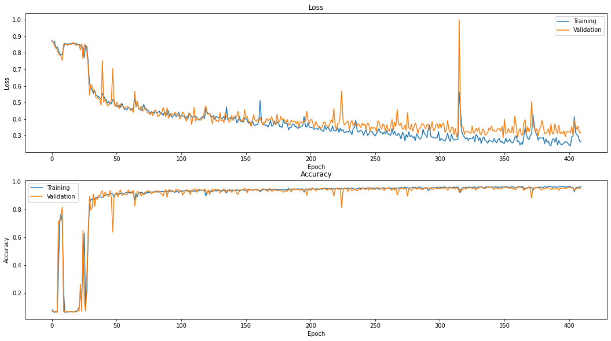
    


    
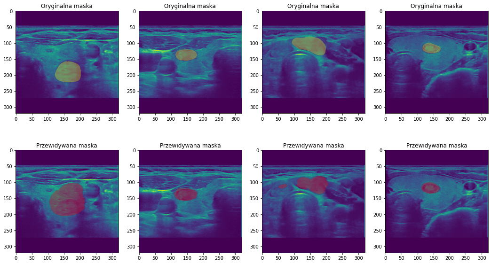
    


    Dice coefficient=0.827840268611908
    accuracy=0.9782820129394532, precision=0.7967899739098024, recall=0.8612665966666918, f1=0.827774638411564
    loss=0.25191575288772583


    
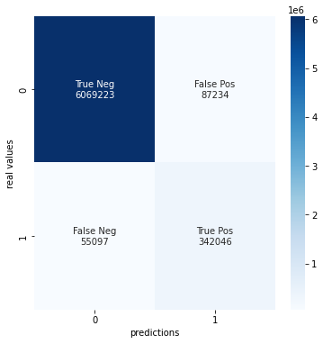
    


```python
transunet_2d_tester = ModelTester('transunet_2d/samsung/test_arch_2/', custom_objects, samsung_images, samsung_masks)
transunet_2d_tester.create_report(plot_history=True)
```

    WARNING:tensorflow:Collective ops is not configured at program startup. Some performance features may not be enabled.
    INFO:tensorflow:Using MirroredStrategy with devices ('/job:localhost/replica:0/task:0/device:GPU:0', '/job:localhost/replica:0/task:0/device:GPU:1', '/job:localhost/replica:0/task:0/device:GPU:2')


    
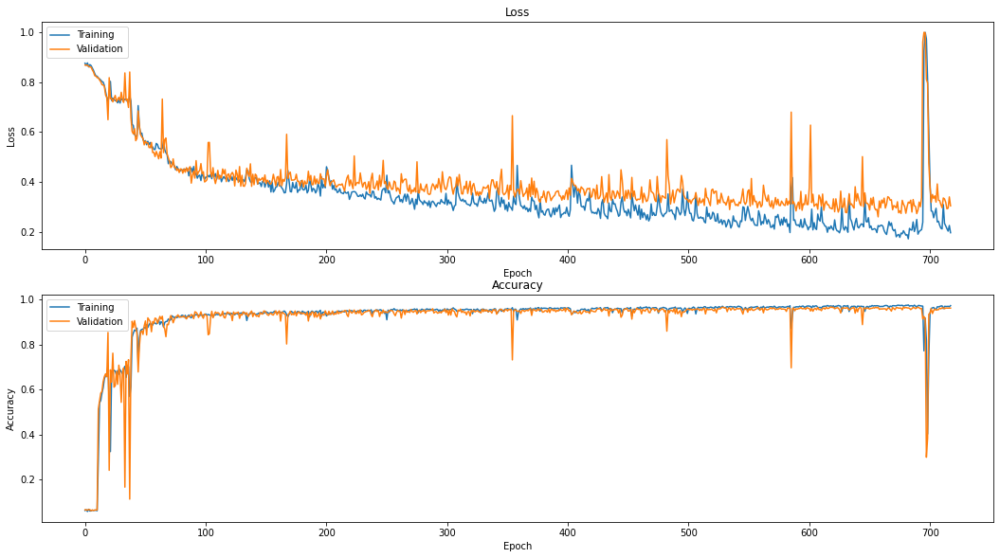
    


    

    


    Dice coefficient=0.8332201838493347
    accuracy=0.979171142578125, precision=0.8093630638265548, recall=0.8584942955056492, f1=0.8332050332724824
    loss=0.2492772340774536


    

    


## 4.2. GE


```python
transunet_2d_tester = ModelTester('transunet_2d/ge/320_nf4_fi3/', custom_objects=custom_objects, ds=test_ge_gen, batch_id=1)
transunet_2d_tester.create_report(plot_history=True)
```

    WARNING:tensorflow:Collective ops is not configured at program startup. Some performance features may not be enabled.
    INFO:tensorflow:Using MirroredStrategy with devices ('/job:localhost/replica:0/task:0/device:GPU:0', '/job:localhost/replica:0/task:0/device:GPU:1', '/job:localhost/replica:0/task:0/device:GPU:2')
    WARNING:tensorflow:6 out of the last 6 calls to <function Model.make_predict_function.<locals>.predict_function at 0x7f6afc173378> triggered tf.function retracing. Tracing is expensive and the excessive number of tracings could be due to (1) creating @tf.function repeatedly in a loop, (2) passing tensors with different shapes, (3) passing Python objects instead of tensors. For (1), please define your @tf.function outside of the loop. For (2), @tf.function has experimental_relax_shapes=True option that relaxes argument shapes that can avoid unnecessary retracing. For (3), please refer to https://www.tensorflow.org/guide/function#controlling_retracing and https://www.tensorflow.org/api_docs/python/tf/function for  more details.


    

    


    

    


    Dice coefficient=0.8399377465248108
    accuracy=0.971876220703125, precision=0.8466739459096254, recall=0.8334550565668536, f1=0.8400124995659872
    loss=0.2563346028327942


    

    


## 4.3. Samsung on GE


```python
transunet_2d_tester = ModelTester('transunet_2d/samsung/320_nf4_fi0/', custom_objects=custom_objects, ds=test_ge_gen, batch_id=1)
transunet_2d_tester.create_report(plot_history=False)
```

    WARNING:tensorflow:Collective ops is not configured at program startup. Some performance features may not be enabled.
    INFO:tensorflow:Using MirroredStrategy with devices ('/job:localhost/replica:0/task:0/device:GPU:0', '/job:localhost/replica:0/task:0/device:GPU:1', '/job:localhost/replica:0/task:0/device:GPU:2')


    

    


    Dice coefficient=0.4845745861530304
    accuracy=0.780294189453125, precision=0.35855671763912855, recall=0.7467683831320195, f1=0.48448880805419114
    loss=0.5368759036064148


    
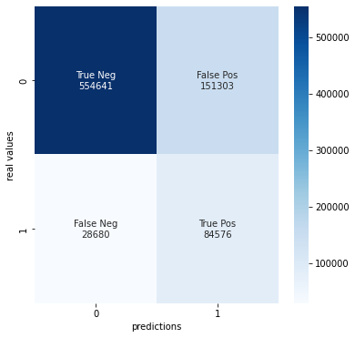
    


## 4.4 GE on Samsung


```python
transunet_2d_tester = ModelTester('transunet_2d/ge/320_nf4_fi1/', custom_objects=custom_objects, ds=test_samsung_gen, batch_id=0)
transunet_2d_tester.create_report(plot_history=False)
```

    WARNING:tensorflow:Collective ops is not configured at program startup. Some performance features may not be enabled.
    INFO:tensorflow:Using MirroredStrategy with devices ('/job:localhost/replica:0/task:0/device:GPU:0', '/job:localhost/replica:0/task:0/device:GPU:1', '/job:localhost/replica:0/task:0/device:GPU:2')


    

    


    Dice coefficient=0.6104358434677124
    accuracy=0.944107666015625, precision=0.4605149828381905, recall=0.9036171930178589, f1=0.6101010789130823
    loss=0.4041687846183777


    

    


## 4.5. Mix on Samsung

Retrain all

'transunet_2d/mix/320_nf4_fi2/'


```python
transunet_2d_tester = ModelTester('transunet_2d/mix/320_nf4_fi2/', custom_objects, samsung_images, samsung_masks)
transunet_2d_tester.create_report(plot_history=True)
```

    WARNING:tensorflow:Collective ops is not configured at program startup. Some performance features may not be enabled.
    INFO:tensorflow:Using MirroredStrategy with devices ('/job:localhost/replica:0/task:0/device:GPU:0', '/job:localhost/replica:0/task:0/device:GPU:1', '/job:localhost/replica:0/task:0/device:GPU:2')
    INFO:tensorflow:Reduce to /job:localhost/replica:0/task:0/device:CPU:0 then broadcast to ('/job:localhost/replica:0/task:0/device:CPU:0',).
    INFO:tensorflow:Reduce to /job:localhost/replica:0/task:0/device:CPU:0 then broadcast to ('/job:localhost/replica:0/task:0/device:CPU:0',).
    INFO:tensorflow:Reduce to /job:localhost/replica:0/task:0/device:CPU:0 then broadcast to ('/job:localhost/replica:0/task:0/device:CPU:0',).
    INFO:tensorflow:Reduce to /job:localhost/replica:0/task:0/device:CPU:0 then broadcast to ('/job:localhost/replica:0/task:0/device:CPU:0',).
    INFO:tensorflow:Reduce to /job:localhost/replica:0/task:0/device:CPU:0 then broadcast to ('/job:localhost/replica:0/task:0/device:CPU:0',).
    INFO:tensorflow:Reduce to /job:localhost/replica:0/task:0/device:CPU:0 then broadcast to ('/job:localhost/replica:0/task:0/device:CPU:0',).
    INFO:tensorflow:Reduce to /job:localhost/replica:0/task:0/device:CPU:0 then broadcast to ('/job:localhost/replica:0/task:0/device:CPU:0',).
    INFO:tensorflow:Reduce to /job:localhost/replica:0/task:0/device:CPU:0 then broadcast to ('/job:localhost/replica:0/task:0/device:CPU:0',).
    INFO:tensorflow:Reduce to /job:localhost/replica:0/task:0/device:CPU:0 then broadcast to ('/job:localhost/replica:0/task:0/device:CPU:0',).
    INFO:tensorflow:Reduce to /job:localhost/replica:0/task:0/device:CPU:0 then broadcast to ('/job:localhost/replica:0/task:0/device:CPU:0',).


    

    


    

    


    Dice coefficient=0.8459200859069824
    accuracy=0.973375244140625, precision=0.8036803209175226, recall=0.892021515015688, f1=0.8455497567573308
    loss=0.22421154379844666


    

    


# 5. Compare metrics


```python
import sklearn.metrics as metrics
from IPython.display import clear_output
from tabulate import tabulate
import math
```


```python
def plot_roc(output, masks):
    # input_image = np.expand_dims(image, 0)
    labels = []
    plt.figure(figsize=(15, 15))
    plt.plot([0, 1], [0, 1])
    labels.append('baseline')
    # plt.plot([0, 0], [0, 1], color='black')
    for key, value in output.items():
        fpr, tpr, threshold = metrics.roc_curve(np.round(masks).astype(int).flatten(), value['prediction'].flatten())
        # fpr, tpr, threshold = metrics.roc_curve(np.round(images).astype(int), value['prediction'])
        roc_auc = metrics.auc(fpr, tpr)
        plt.plot(fpr,tpr,label="AUC="+str(roc_auc))
        plt.ylabel('True Positive Rate')
        plt.xlabel('False Positive Rate')
        labels.append(f'{key}, auc={round(roc_auc,3)}')
    plt.grid()
    plt.legend(labels)
    plt.show()
            
        
def dice_coef(y_true, y_pred, smooth=100):        
    y_true_f = K.flatten(y_true)
    y_pred_f = K.flatten(y_pred)
    intersection = K.sum(y_true_f * y_pred_f)
    dice = (2. * intersection + smooth) / (K.sum(y_true_f) + K.sum(y_pred_f) + smooth)
    return dice


def calculate_segmentation_metrics(y_true, y_pred):
    """
    Calculates TP, TN, FP, FN values for binary segmentation.
    """
    # Convert to numpy arrays of int type
    # y_true = np.array(y_true, dtype=int).flatten()
    # y_pred = np.array(y_pred, dtype=int).flatten()

    y_true = np.round(y_true).astype(int).flatten()
    y_pred = np.round(y_pred).astype(int).flatten()

    TP = np.sum((y_true == 1) & (y_pred == 1))
    TN = np.sum((y_true == 0) & (y_pred == 0))
    FP = np.sum((y_true == 0) & (y_pred == 1))
    FN = np.sum((y_true == 1) & (y_pred == 0))

    return TP, TN, FP, FN


def basic_metrics(y_true, y_pred):
    TP, TN, FP, FN = calculate_segmentation_metrics(y_true, y_pred)

    accuracy = (TP + TN) / (TP + TN + FP + FN)
    precision = TP / (TP + FP)
    recall = TP / (TP + FN)
    f1 = 2 * precision * recall / (precision + recall)

    return accuracy, precision, recall, f1

def get_average_accuracy(y_true, y_pred):
    TP, TN, FP, FN = calculate_segmentation_metrics(y_true, y_pred)
    acc1 = TP / (TP + FP)
    acc2 = TN / (TN + FN)
    return (acc1 + acc2) / 2


def make_predictions(model_name, model_paths, images, masks):
    
    gpus = tf.config.list_logical_devices('GPU')
    strategy = tf.distribute.MirroredStrategy(gpus)

    losses = []
    dice_coefs = []
    accuracies = []
    precisions = []
    recalls = []
    f1s = []
    roc_aucs = []
    cohen_kappa_scores = []
    matthews_corrcoefs = []
    avg_accuracies = []
    ious = []
    
    predictions_output = {}
    
    for i, m_path in enumerate(model_paths):
        name = m_path.split('/')[0]
        title = ' '.join(name.split('_')[:-1]).capitalize()

        print('loading model: ', name)
        with strategy.scope():
            model = tf.keras.models.load_model(f'output/{m_path}model/model', custom_objects=custom_objects)
            
            for idx in range(8):
                start_index = idx*8
                end_index = start_index + 8
                sub_pred = model.predict(images[start_index:end_index])
                if idx == 0:
                    predictions = sub_pred
                else:
                    predictions = np.concatenate((predictions, sub_pred), axis=0)
                    
            predictions_output['fold_'+str(i)] = predictions
            
            loss = custom_focal_tversky(masks, predictions)
            accuracy, precision, recall, f1 = basic_metrics(masks, predictions)
            avg_accuracy_value = get_average_accuracy(masks, predictions)
            fpr, tpr, threshold = metrics.roc_curve(np.round(masks).astype(int).flatten(), predictions.flatten())
            roc_auc = metrics.auc(fpr, tpr)
            iou = metrics.jaccard_score(np.round(masks).astype(int).flatten(), np.round(predictions).astype(int).flatten())
            
            losses.append(loss)
            accuracies.append(accuracy)
            precisions.append(precision)
            recalls.append(recall)
            f1s.append(f1)
            roc_aucs.append(roc_auc)
            avg_accuracies.append(avg_accuracy_value)
            ious.append(iou)
            
    n_folds = len(losses)
            
    avg_loss = np.mean(losses)
    std_loss = np.std(losses) / math.sqrt(n_folds)

    avg_accuracy = np.mean(accuracies)
    std_accuracy = np.std(accuracies) / math.sqrt(n_folds)

    avg_precision = np.mean(precisions)
    std_precisions = np.std(precisions) / math.sqrt(n_folds)

    avg_recalls = np.mean(recalls)
    std_recalls = np.std(recalls) / math.sqrt(n_folds)

    avg_f1 = np.mean(f1s)
    std_f1 = np.std(f1s) / math.sqrt(n_folds)

    avg_roc_auc = np.mean(roc_aucs)
    std_roc_auc = np.std(roc_aucs) / math.sqrt(n_folds)
    
    avg_avg_accuracy = np.mean(avg_accuracies)
    std_avg_accuracy = np.std(avg_accuracies) / math.sqrt(n_folds)
    
    avg_iou = np.mean(ious)
    std_iou = np.std(ious) / math.sqrt(n_folds)
    
    metrics_output = {
        'Focal Tversky': [avg_loss, std_loss],
        'Dokładność': [avg_accuracy, std_accuracy],
        'Średnia dokładność': [avg_avg_accuracy, std_avg_accuracy],
        'Precyzja': [avg_precision, std_precisions],
        'Czułość': [avg_recalls, std_recalls],
        'F1/Dice': [avg_f1, std_f1],
        'IoU': [avg_iou, std_iou],
        'ROC AUC': [avg_roc_auc, std_roc_auc],
    }
    
    return predictions_output, metrics_output
    
def generate_metrics_matrix(models, images, masks):
    output = {}
    for model, paths in models.items():
        predictions, metrics = make_predictions(model, paths, images, masks)
        output[model] = {}
        output[model]['metrics'] = metrics
        output[model]['predictions'] = predictions
    return output

def generate_model_metrics_tab(metrics_dict):
    headers = ['Metryki']
    output_standard = [['Focal Tversky'], ['Dokładność'], ['Śr. dokładność'], ['Precyzja'], ['Czułość'], ['F1/Dice'], ['IoU'], ['ROC AUC']]
    output_latex = [['Focal Tversky'], ['Dokładność'], ['Śr. dokładność'], ['Precyzja'], ['Czułość'], ['F1/Dice'], ['IoU'], ['ROC AUC']]
    
    for model in metrics_dict:
        # metrics = make_predictions(paths, images, masks)
        print(model)
        metrics = metrics_dict.get(model).get('metrics')
        for index, (key, values) in enumerate(metrics.items()):
            mean, std = values
            # cell = r'\[%f \pm %f\]' % (mean, std)
            cell = f'\[{mean:.3} \pm {std:.2e}\]'.replace('-', r'\text{-}')
            output_latex[index].append(f'\[{mean:.3} \pm {std:.2e}\]'.replace('-', r'\text{-}'))
            output_standard[index].append(f'{mean:.3} +- {std:.2e}')
        
        title = model
        # if '$' in title:
        #     title.replace('$', '')
        headers.append(title)

    clear_output(wait=False)
    
    # Readable table
    print(tabulate(output_standard, headers, tablefmt="heavy_outline"))
    
    print('\n\n')
    
    # Github table
    print(tabulate(output_standard, headers, tablefmt="github"))
    
    print('\n\n')
    
    # Create the LaTeX table
    print(tabulate(output_latex, headers, tablefmt="latex_raw"))
    

def print_metrics_plot(metrics_dict):
    
    # metric_names = metrics_dict.get(list(metrics_dict.keys())[0]).get('metrics')
    
    metric_names = list(metrics_dict.get(list(metrics_dict.keys())[0]).get('metrics').keys())
    
    # TODO Plot loss separately
    
    plt.figure(figsize=(20, 10))
    for i, metric_name in enumerate(metric_names):
        plt.subplot(2, 4, i+1)
        
        bar_colors = ['tab:orange', 'tab:green', 'tab:red', 'tab:purple']
        
        roc_values = []
        roc_errors = []
        highs = []
        lows = []
        x = []
        for model in metrics_dict:
            metrics = metrics_dict.get(model).get('metrics')
            value = metrics.get(metric_name)[0]
            std = metrics.get(metric_name)[1]
            roc_values.append(value)
            roc_errors.append(std)
            highs.append(value + std)
            lows.append(value - std)
            x.append(model)

        low = min(lows) - 0.01
        high = max(highs) + 0.01
        # plt.ylim([math.ceil(low-0.5*(high-low)), math.ceil(high+0.5*(high-low))])
        plt.ylim([low, high])
        plt.bar(x, roc_values, color=bar_colors)
        plt.errorbar(x, roc_values, yerr=roc_errors, fmt='o', color='b')
        plt.title(metric_name)
        
        # Grids
        plt.grid(b=True, which='major', color='#555555', linestyle='-')
        plt.minorticks_on()
        plt.grid(b=True, which='minor', color='#777777', linestyle='-', alpha=0.5)
        
    plt.show()
        
def plot_rocs(data, masks, n_folds=4):
    
    plt.figure(figsize=(20, 20))
    
    for i in range(n_folds):
        labels = []
        plt.subplot(2, n_folds/2, i+1)
        plt.plot([0, 1], [0, 1])
        labels.append('Baza')
        for model, value in data.items():
            predictions = value['predictions']['fold_'+str(i)]
        
            fpr, tpr, threshold = metrics.roc_curve(np.round(masks).astype(int).flatten(), predictions.flatten())
            roc_auc = metrics.auc(fpr, tpr)
            plt.plot(fpr,tpr,label="AUC="+str(roc_auc))
            plt.ylabel('TPR')
            plt.xlabel('FPR')
            labels.append(f'{model}, auc={round(roc_auc,3)}')
            plt.title('Podział '+str(i))
        plt.grid()
        plt.legend(labels)
        
        # Grids
        plt.grid(b=True, which='major', color='#333333', linestyle='-')
        plt.minorticks_on()
        plt.grid(b=True, which='minor', color='#999999', linestyle='-', alpha=0.3)
        
    clear_output(wait=False)
    plt.show()
    
# print_metrics_plot(s_on_s)
# plot_rocs(s_on_s, samsung_masks)
```


```python
samsung_images, samsung_masks = [], []
for i in range(8):
    images, masks = test_samsung_gen.__getitem__(i)
    samsung_images.extend(images)
    samsung_masks.extend(masks)
samsung_images = np.array(samsung_images)
samsung_masks = np.array(samsung_masks)
```


```python
ge_images, ge_masks = [], []
for i in range(8):
    images, masks = test_ge_gen.__getitem__(i)
    ge_images.extend(images)
    ge_masks.extend(masks)
ge_images = np.array(ge_images)
ge_masks = np.array(ge_masks)
```

## 5.1. Samsung on Samsung


```python
samsung_models = {
    'U-Net': ['unet_2d/samsung/320_nf4_fi0/', 'unet_2d/samsung/320_nf4_fi1/', 'unet_2d/samsung/320_nf4_fi2/', 'unet_2d/samsung/320_nf4_fi3/'],
    r'U$^2$-Net': ['u2net_2d/samsung/320_nf4_fi0/', 'u2net_2d/samsung/320_nf4_fi1/', 'u2net_2d/samsung/320_nf4_fi2/', 'u2net_2d/samsung/320_nf4_fi3/'],
    'U-Net 3+': ['unet_3plus_2d/samsung/320_nf4_fi0/', 'unet_3plus_2d/samsung/320_nf4_fi1/', 'unet_3plus_2d/samsung/320_nf4_fi2/', 'unet_3plus_2d/samsung/320_nf4_fi3/'],
    'TransUnet': ['transunet_2d/samsung/320_nf4_fi0/', 'transunet_2d/samsung/320_nf4_fi1/', 'transunet_2d/samsung/320_nf4_fi2/', 'transunet_2d/samsung/320_nf4_fi3/'],
}
```


```python
s_on_s = generate_metrics_matrix(samsung_models, samsung_images, samsung_masks)
```


```python
generate_model_metrics_tab(s_on_s)
```

    Metryki             U-Net              U$^2$-Net          U-Net 3+           TransUnet
    ------------------  -----------------  -----------------  -----------------  -----------------
    Focal Tversky       0.278 +- 2.03e-02  0.266 +- 7.24e-03  0.305 +- 6.75e-03  0.316 +- 2.39e-02
    Dokładność          0.972 +- 3.73e-03  0.973 +- 1.90e-03  0.969 +- 1.94e-03  0.965 +- 3.73e-03
    Średnia dokładność  0.86 +- 1.64e-02   0.864 +- 1.10e-02  0.852 +- 1.20e-02  0.833 +- 1.75e-02
    Precyzja            0.729 +- 3.22e-02  0.736 +- 2.22e-02  0.715 +- 2.54e-02  0.677 +- 3.47e-02
    Czułość             0.864 +- 1.03e-02  0.881 +- 5.84e-03  0.839 +- 2.32e-02  0.843 +- 2.53e-02
    F1/Dice             0.79 +- 2.29e-02   0.801 +- 1.12e-02  0.769 +- 6.76e-03  0.749 +- 2.43e-02
    IoU                 0.655 +- 3.01e-02  0.669 +- 1.58e-02  0.625 +- 8.81e-03  0.601 +- 3.21e-02
    ROC AUC             0.946 +- 6.29e-03  0.988 +- 6.18e-04  0.932 +- 6.76e-03  0.96 +- 5.72e-03
    
    
    
    | Metryki            | U-Net             | U$^2$-Net         | U-Net 3+          | TransUnet         |
    |--------------------|-------------------|-------------------|-------------------|-------------------|
    | Focal Tversky      | 0.278 +- 2.03e-02 | 0.266 +- 7.24e-03 | 0.305 +- 6.75e-03 | 0.316 +- 2.39e-02 |
    | Dokładność         | 0.972 +- 3.73e-03 | 0.973 +- 1.90e-03 | 0.969 +- 1.94e-03 | 0.965 +- 3.73e-03 |
    | Średnia dokładność | 0.86 +- 1.64e-02  | 0.864 +- 1.10e-02 | 0.852 +- 1.20e-02 | 0.833 +- 1.75e-02 |
    | Precyzja           | 0.729 +- 3.22e-02 | 0.736 +- 2.22e-02 | 0.715 +- 2.54e-02 | 0.677 +- 3.47e-02 |
    | Czułość            | 0.864 +- 1.03e-02 | 0.881 +- 5.84e-03 | 0.839 +- 2.32e-02 | 0.843 +- 2.53e-02 |
    | F1/Dice            | 0.79 +- 2.29e-02  | 0.801 +- 1.12e-02 | 0.769 +- 6.76e-03 | 0.749 +- 2.43e-02 |
    | IoU                | 0.655 +- 3.01e-02 | 0.669 +- 1.58e-02 | 0.625 +- 8.81e-03 | 0.601 +- 3.21e-02 |
    | ROC AUC            | 0.946 +- 6.29e-03 | 0.988 +- 6.18e-04 | 0.932 +- 6.76e-03 | 0.96 +- 5.72e-03  |
    
    
    
    \begin{tabular}{lllll}
    \hline
     Metryki            & U-Net                         & U$^2$-Net                     & U-Net 3+                      & TransUnet                     \\
    \hline
     Focal Tversky      & \[0.278 \pm 2.03e\text{-}02\] & \[0.266 \pm 7.24e\text{-}03\] & \[0.305 \pm 6.75e\text{-}03\] & \[0.316 \pm 2.39e\text{-}02\] \\
     Dokładność         & \[0.972 \pm 3.73e\text{-}03\] & \[0.973 \pm 1.90e\text{-}03\] & \[0.969 \pm 1.94e\text{-}03\] & \[0.965 \pm 3.73e\text{-}03\] \\
     Średnia dokładność & \[0.86 \pm 1.64e\text{-}02\]  & \[0.864 \pm 1.10e\text{-}02\] & \[0.852 \pm 1.20e\text{-}02\] & \[0.833 \pm 1.75e\text{-}02\] \\
     Precyzja           & \[0.729 \pm 3.22e\text{-}02\] & \[0.736 \pm 2.22e\text{-}02\] & \[0.715 \pm 2.54e\text{-}02\] & \[0.677 \pm 3.47e\text{-}02\] \\
     Czułość            & \[0.864 \pm 1.03e\text{-}02\] & \[0.881 \pm 5.84e\text{-}03\] & \[0.839 \pm 2.32e\text{-}02\] & \[0.843 \pm 2.53e\text{-}02\] \\
     F1/Dice            & \[0.79 \pm 2.29e\text{-}02\]  & \[0.801 \pm 1.12e\text{-}02\] & \[0.769 \pm 6.76e\text{-}03\] & \[0.749 \pm 2.43e\text{-}02\] \\
     IoU                & \[0.655 \pm 3.01e\text{-}02\] & \[0.669 \pm 1.58e\text{-}02\] & \[0.625 \pm 8.81e\text{-}03\] & \[0.601 \pm 3.21e\text{-}02\] \\
     ROC AUC            & \[0.946 \pm 6.29e\text{-}03\] & \[0.988 \pm 6.18e\text{-}04\] & \[0.932 \pm 6.76e\text{-}03\] & \[0.96 \pm 5.72e\text{-}03\]  \\
    \hline
    \end{tabular}


```python
print_metrics_plot(s_on_s)
```


    

    


```python
plot_rocs(s_on_s, samsung_masks)
```


    

    


```python
output = {}

model_paths = ['unet_2d/samsung/320_nf4_fi0/', 'u2net_2d/samsung/320_nf4_fi0/', 'unet_3plus_2d/samsung/320_nf4_fi0/', 'transunet_2d/samsung/320_nf4_fi0/']
plot_comparison(model_paths, samsung_images, samsung_masks, output, n=10)
```


    

    


```python
plot_roc(output, samsung_masks)
```


    

    


## 5.2. GE on GE


```python
ge_models = {
    'U-Net': ['unet_2d/ge/320_nf4_fi0/', 'unet_2d/ge/320_nf4_fi1/', 'unet_2d/ge/320_nf4_fi2/', 'unet_2d/ge/320_nf4_fi3/'],
    r'U$^2$-Net': ['u2net_2d/ge/320_nf4_fi0/', 'u2net_2d/ge/320_nf4_fi1/', 'u2net_2d/ge/320_nf4_fi2/', 'u2net_2d/ge/320_nf4_fi3/'],
    'U-Net 3+': ['unet_3plus_2d/ge/320_nf4_fi0/', 'unet_3plus_2d/ge/320_nf4_fi1/', 'unet_3plus_2d/ge/320_nf4_fi2/', 'unet_3plus_2d/ge/320_nf4_fi3/'],
    'TransUnet': ['transunet_2d/ge/320_nf4_fi0/', 'transunet_2d/ge/320_nf4_fi1/', 'transunet_2d/ge/320_nf4_fi2/', 'transunet_2d/ge/320_nf4_fi3/']
}
```


```python
g_on_g = generate_metrics_matrix(ge_models, ge_images, ge_masks)
```


```python
generate_model_metrics_tab(g_on_g)
```

    Metryki             U-Net              U$^2$-Net          U-Net 3+           TransUnet
    ------------------  -----------------  -----------------  -----------------  -----------------
    Focal Tversky       0.366 +- 1.40e-02  0.38 +- 7.26e-03   0.359 +- 3.30e-03  0.344 +- 1.22e-02
    Dokładność          0.945 +- 3.13e-03  0.947 +- 4.21e-03  0.947 +- 2.08e-03  0.945 +- 6.15e-03
    Średnia dokładność  0.8 +- 9.00e-03    0.812 +- 1.43e-02  0.809 +- 8.16e-03  0.805 +- 1.80e-02
    Precyzja            0.616 +- 1.74e-02  0.644 +- 2.93e-02  0.634 +- 1.76e-02  0.625 +- 3.75e-02
    Czułość             0.807 +- 1.42e-02  0.774 +- 1.09e-02  0.809 +- 1.56e-02  0.845 +- 2.48e-02
    F1/Dice             0.699 +- 1.43e-02  0.7 +- 1.37e-02    0.709 +- 4.71e-03  0.713 +- 1.86e-02
    IoU                 0.538 +- 1.68e-02  0.54 +- 1.62e-02   0.55 +- 5.69e-03   0.555 +- 2.20e-02
    ROC AUC             0.895 +- 8.19e-03  0.961 +- 1.60e-03  0.907 +- 5.08e-03  0.938 +- 3.22e-03
    
    
    
    | Metryki            | U-Net             | U$^2$-Net         | U-Net 3+          | TransUnet         |
    |--------------------|-------------------|-------------------|-------------------|-------------------|
    | Focal Tversky      | 0.366 +- 1.40e-02 | 0.38 +- 7.26e-03  | 0.359 +- 3.30e-03 | 0.344 +- 1.22e-02 |
    | Dokładność         | 0.945 +- 3.13e-03 | 0.947 +- 4.21e-03 | 0.947 +- 2.08e-03 | 0.945 +- 6.15e-03 |
    | Średnia dokładność | 0.8 +- 9.00e-03   | 0.812 +- 1.43e-02 | 0.809 +- 8.16e-03 | 0.805 +- 1.80e-02 |
    | Precyzja           | 0.616 +- 1.74e-02 | 0.644 +- 2.93e-02 | 0.634 +- 1.76e-02 | 0.625 +- 3.75e-02 |
    | Czułość            | 0.807 +- 1.42e-02 | 0.774 +- 1.09e-02 | 0.809 +- 1.56e-02 | 0.845 +- 2.48e-02 |
    | F1/Dice            | 0.699 +- 1.43e-02 | 0.7 +- 1.37e-02   | 0.709 +- 4.71e-03 | 0.713 +- 1.86e-02 |
    | IoU                | 0.538 +- 1.68e-02 | 0.54 +- 1.62e-02  | 0.55 +- 5.69e-03  | 0.555 +- 2.20e-02 |
    | ROC AUC            | 0.895 +- 8.19e-03 | 0.961 +- 1.60e-03 | 0.907 +- 5.08e-03 | 0.938 +- 3.22e-03 |
    
    
    
    \begin{tabular}{lllll}
    \hline
     Metryki            & U-Net                         & U$^2$-Net                     & U-Net 3+                      & TransUnet                     \\
    \hline
     Focal Tversky      & \[0.366 \pm 1.40e\text{-}02\] & \[0.38 \pm 7.26e\text{-}03\]  & \[0.359 \pm 3.30e\text{-}03\] & \[0.344 \pm 1.22e\text{-}02\] \\
     Dokładność         & \[0.945 \pm 3.13e\text{-}03\] & \[0.947 \pm 4.21e\text{-}03\] & \[0.947 \pm 2.08e\text{-}03\] & \[0.945 \pm 6.15e\text{-}03\] \\
     Średnia dokładność & \[0.8 \pm 9.00e\text{-}03\]   & \[0.812 \pm 1.43e\text{-}02\] & \[0.809 \pm 8.16e\text{-}03\] & \[0.805 \pm 1.80e\text{-}02\] \\
     Precyzja           & \[0.616 \pm 1.74e\text{-}02\] & \[0.644 \pm 2.93e\text{-}02\] & \[0.634 \pm 1.76e\text{-}02\] & \[0.625 \pm 3.75e\text{-}02\] \\
     Czułość            & \[0.807 \pm 1.42e\text{-}02\] & \[0.774 \pm 1.09e\text{-}02\] & \[0.809 \pm 1.56e\text{-}02\] & \[0.845 \pm 2.48e\text{-}02\] \\
     F1/Dice            & \[0.699 \pm 1.43e\text{-}02\] & \[0.7 \pm 1.37e\text{-}02\]   & \[0.709 \pm 4.71e\text{-}03\] & \[0.713 \pm 1.86e\text{-}02\] \\
     IoU                & \[0.538 \pm 1.68e\text{-}02\] & \[0.54 \pm 1.62e\text{-}02\]  & \[0.55 \pm 5.69e\text{-}03\]  & \[0.555 \pm 2.20e\text{-}02\] \\
     ROC AUC            & \[0.895 \pm 8.19e\text{-}03\] & \[0.961 \pm 1.60e\text{-}03\] & \[0.907 \pm 5.08e\text{-}03\] & \[0.938 \pm 3.22e\text{-}03\] \\
    \hline
    \end{tabular}


```python
print_metrics_plot(g_on_g)
```


    
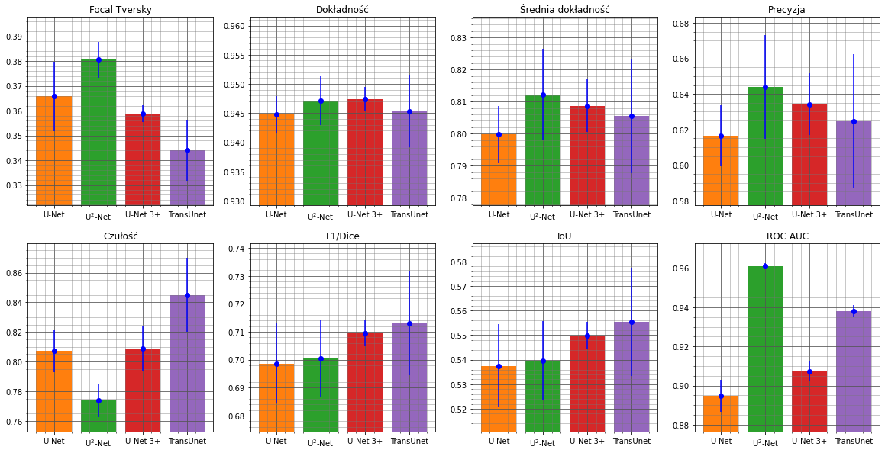
    


```python
plot_rocs(g_on_g, ge_masks)
```


    

    


```python
output = {}

model_paths = ['unet_2d/ge/320_nf4_fi0/', 'u2net_2d/ge/320_nf4_fi0/', 'unet_3plus_2d/ge/320_nf4_fi0/', 'transunet_2d/ge/320_nf4_fi1/']
plot_comparison(model_paths, ge_images, ge_masks, output, n=10)
```


    

    


```python
plot_roc(output, ge_masks)
```


    

    


## 5.3. Samsung on GE


```python
s_on_g = generate_metrics_matrix(samsung_models, ge_images, ge_masks)
```

    WARNING:tensorflow:Collective ops is not configured at program startup. Some performance features may not be enabled.
    INFO:tensorflow:Using MirroredStrategy with devices ('/job:localhost/replica:0/task:0/device:GPU:0', '/job:localhost/replica:0/task:0/device:GPU:1', '/job:localhost/replica:0/task:0/device:GPU:2')
    loading model:  unet_2d
    loading model:  unet_2d
    loading model:  unet_2d
    loading model:  unet_2d
    WARNING:tensorflow:Collective ops is not configured at program startup. Some performance features may not be enabled.
    INFO:tensorflow:Using MirroredStrategy with devices ('/job:localhost/replica:0/task:0/device:GPU:0', '/job:localhost/replica:0/task:0/device:GPU:1', '/job:localhost/replica:0/task:0/device:GPU:2')
    loading model:  u2net_2d
    loading model:  u2net_2d
    loading model:  u2net_2d
    loading model:  u2net_2d
    WARNING:tensorflow:Collective ops is not configured at program startup. Some performance features may not be enabled.
    INFO:tensorflow:Using MirroredStrategy with devices ('/job:localhost/replica:0/task:0/device:GPU:0', '/job:localhost/replica:0/task:0/device:GPU:1', '/job:localhost/replica:0/task:0/device:GPU:2')
    loading model:  unet_3plus_2d
    loading model:  unet_3plus_2d
    loading model:  unet_3plus_2d
    loading model:  unet_3plus_2d
    WARNING:tensorflow:Collective ops is not configured at program startup. Some performance features may not be enabled.
    INFO:tensorflow:Using MirroredStrategy with devices ('/job:localhost/replica:0/task:0/device:GPU:0', '/job:localhost/replica:0/task:0/device:GPU:1', '/job:localhost/replica:0/task:0/device:GPU:2')
    loading model:  transunet_2d
    loading model:  transunet_2d
    loading model:  transunet_2d
    loading model:  transunet_2d


```python
generate_model_metrics_tab(s_on_g)
```

    Metryki             U-Net              U$^2$-Net          U-Net 3+           TransUnet
    ------------------  -----------------  -----------------  -----------------  -----------------
    Focal Tversky       0.572 +- 3.35e-02  0.67 +- 1.99e-02   0.641 +- 6.64e-02  0.615 +- 2.55e-02
    Dokładność          0.802 +- 3.52e-02  0.646 +- 3.93e-02  0.663 +- 7.46e-02  0.734 +- 3.98e-02
    Średnia dokładność  0.638 +- 2.12e-02  0.587 +- 7.22e-03  0.61 +- 3.72e-02   0.609 +- 1.09e-02
    Precyzja            0.291 +- 4.34e-02  0.181 +- 1.49e-02  0.234 +- 7.45e-02  0.229 +- 2.26e-02
    Czułość             0.847 +- 2.27e-02  0.94 +- 8.59e-03   0.894 +- 2.72e-02  0.912 +- 1.28e-02
    F1/Dice             0.424 +- 4.34e-02  0.303 +- 2.07e-02  0.346 +- 7.94e-02  0.363 +- 2.86e-02
    IoU                 0.273 +- 3.57e-02  0.179 +- 1.43e-02  0.222 +- 6.59e-02  0.223 +- 2.10e-02
    ROC AUC             0.835 +- 1.56e-02  0.908 +- 4.07e-03  0.839 +- 2.54e-02  0.825 +- 1.57e-02
    
    
    
    | Metryki            | U-Net             | U$^2$-Net         | U-Net 3+          | TransUnet         |
    |--------------------|-------------------|-------------------|-------------------|-------------------|
    | Focal Tversky      | 0.572 +- 3.35e-02 | 0.67 +- 1.99e-02  | 0.641 +- 6.64e-02 | 0.615 +- 2.55e-02 |
    | Dokładność         | 0.802 +- 3.52e-02 | 0.646 +- 3.93e-02 | 0.663 +- 7.46e-02 | 0.734 +- 3.98e-02 |
    | Średnia dokładność | 0.638 +- 2.12e-02 | 0.587 +- 7.22e-03 | 0.61 +- 3.72e-02  | 0.609 +- 1.09e-02 |
    | Precyzja           | 0.291 +- 4.34e-02 | 0.181 +- 1.49e-02 | 0.234 +- 7.45e-02 | 0.229 +- 2.26e-02 |
    | Czułość            | 0.847 +- 2.27e-02 | 0.94 +- 8.59e-03  | 0.894 +- 2.72e-02 | 0.912 +- 1.28e-02 |
    | F1/Dice            | 0.424 +- 4.34e-02 | 0.303 +- 2.07e-02 | 0.346 +- 7.94e-02 | 0.363 +- 2.86e-02 |
    | IoU                | 0.273 +- 3.57e-02 | 0.179 +- 1.43e-02 | 0.222 +- 6.59e-02 | 0.223 +- 2.10e-02 |
    | ROC AUC            | 0.835 +- 1.56e-02 | 0.908 +- 4.07e-03 | 0.839 +- 2.54e-02 | 0.825 +- 1.57e-02 |
    
    
    
    \begin{tabular}{lllll}
    \hline
     Metryki            & U-Net                         & U$^2$-Net                     & U-Net 3+                      & TransUnet                     \\
    \hline
     Focal Tversky      & \[0.572 \pm 3.35e\text{-}02\] & \[0.67 \pm 1.99e\text{-}02\]  & \[0.641 \pm 6.64e\text{-}02\] & \[0.615 \pm 2.55e\text{-}02\] \\
     Dokładność         & \[0.802 \pm 3.52e\text{-}02\] & \[0.646 \pm 3.93e\text{-}02\] & \[0.663 \pm 7.46e\text{-}02\] & \[0.734 \pm 3.98e\text{-}02\] \\
     Średnia dokładność & \[0.638 \pm 2.12e\text{-}02\] & \[0.587 \pm 7.22e\text{-}03\] & \[0.61 \pm 3.72e\text{-}02\]  & \[0.609 \pm 1.09e\text{-}02\] \\
     Precyzja           & \[0.291 \pm 4.34e\text{-}02\] & \[0.181 \pm 1.49e\text{-}02\] & \[0.234 \pm 7.45e\text{-}02\] & \[0.229 \pm 2.26e\text{-}02\] \\
     Czułość            & \[0.847 \pm 2.27e\text{-}02\] & \[0.94 \pm 8.59e\text{-}03\]  & \[0.894 \pm 2.72e\text{-}02\] & \[0.912 \pm 1.28e\text{-}02\] \\
     F1/Dice            & \[0.424 \pm 4.34e\text{-}02\] & \[0.303 \pm 2.07e\text{-}02\] & \[0.346 \pm 7.94e\text{-}02\] & \[0.363 \pm 2.86e\text{-}02\] \\
     IoU                & \[0.273 \pm 3.57e\text{-}02\] & \[0.179 \pm 1.43e\text{-}02\] & \[0.222 \pm 6.59e\text{-}02\] & \[0.223 \pm 2.10e\text{-}02\] \\
     ROC AUC            & \[0.835 \pm 1.56e\text{-}02\] & \[0.908 \pm 4.07e\text{-}03\] & \[0.839 \pm 2.54e\text{-}02\] & \[0.825 \pm 1.57e\text{-}02\] \\
    \hline
    \end{tabular}


```python
print_metrics_plot(s_on_g)
```


    
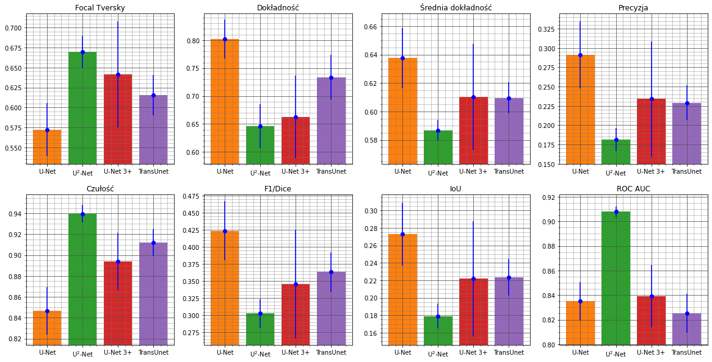
    


```python
plot_rocs(s_on_g, ge_masks)
```


    

    


```python
output = {}

model_paths = ['unet_2d/samsung/320_nf4_fi0/', 'u2net_2d/samsung/320_nf4_fi0/', 'unet_3plus_2d/samsung/320_nf4_fi0/', 'transunet_2d/samsung/320_nf4_fi0/']
plot_comparison(model_paths, ge_images, ge_masks, output, n=10)
```


    

    


```python
plot_roc(output, ge_masks)
```


    

    


## 5.4. GE on Samsung


```python
g_on_s = generate_metrics_matrix(ge_models, samsung_images, samsung_masks)
```

    WARNING:tensorflow:Collective ops is not configured at program startup. Some performance features may not be enabled.
    INFO:tensorflow:Using MirroredStrategy with devices ('/job:localhost/replica:0/task:0/device:GPU:0', '/job:localhost/replica:0/task:0/device:GPU:1', '/job:localhost/replica:0/task:0/device:GPU:2')
    loading model:  unet_2d
    loading model:  unet_2d
    loading model:  unet_2d
    loading model:  unet_2d
    WARNING:tensorflow:Collective ops is not configured at program startup. Some performance features may not be enabled.
    INFO:tensorflow:Using MirroredStrategy with devices ('/job:localhost/replica:0/task:0/device:GPU:0', '/job:localhost/replica:0/task:0/device:GPU:1', '/job:localhost/replica:0/task:0/device:GPU:2')
    loading model:  u2net_2d
    loading model:  u2net_2d
    loading model:  u2net_2d
    loading model:  u2net_2d
    WARNING:tensorflow:Collective ops is not configured at program startup. Some performance features may not be enabled.
    INFO:tensorflow:Using MirroredStrategy with devices ('/job:localhost/replica:0/task:0/device:GPU:0', '/job:localhost/replica:0/task:0/device:GPU:1', '/job:localhost/replica:0/task:0/device:GPU:2')
    loading model:  unet_3plus_2d
    loading model:  unet_3plus_2d
    loading model:  unet_3plus_2d
    loading model:  unet_3plus_2d
    WARNING:tensorflow:Collective ops is not configured at program startup. Some performance features may not be enabled.
    INFO:tensorflow:Using MirroredStrategy with devices ('/job:localhost/replica:0/task:0/device:GPU:0', '/job:localhost/replica:0/task:0/device:GPU:1', '/job:localhost/replica:0/task:0/device:GPU:2')
    loading model:  transunet_2d
    loading model:  transunet_2d
    loading model:  transunet_2d
    loading model:  transunet_2d


```python
generate_model_metrics_tab(g_on_s)
```

    Metryki             U-Net              U$^2$-Net          U-Net 3+           TransUnet
    ------------------  -----------------  -----------------  -----------------  -----------------
    Focal Tversky       0.391 +- 2.27e-02  0.434 +- 1.91e-02  0.398 +- 2.74e-02  0.381 +- 1.48e-02
    Dokładność          0.965 +- 3.02e-03  0.96 +- 3.40e-03   0.967 +- 1.26e-03  0.962 +- 3.99e-03
    Średnia dokładność  0.848 +- 1.47e-02  0.827 +- 1.81e-02  0.867 +- 1.28e-02  0.832 +- 2.12e-02
    Precyzja            0.715 +- 2.89e-02  0.675 +- 3.58e-02  0.754 +- 2.75e-02  0.679 +- 4.39e-02
    Czułość             0.715 +- 2.41e-02  0.677 +- 2.02e-02  0.694 +- 4.43e-02  0.754 +- 2.96e-02
    F1/Dice             0.713 +- 2.22e-02  0.674 +- 2.22e-02  0.717 +- 1.49e-02  0.708 +- 1.72e-02
    IoU                 0.556 +- 2.72e-02  0.51 +- 2.62e-02   0.559 +- 1.85e-02  0.548 +- 2.03e-02
    ROC AUC             0.899 +- 1.81e-02  0.959 +- 7.84e-03  0.866 +- 2.16e-02  0.945 +- 4.32e-03
    
    
    
    | Metryki            | U-Net             | U$^2$-Net         | U-Net 3+          | TransUnet         |
    |--------------------|-------------------|-------------------|-------------------|-------------------|
    | Focal Tversky      | 0.391 +- 2.27e-02 | 0.434 +- 1.91e-02 | 0.398 +- 2.74e-02 | 0.381 +- 1.48e-02 |
    | Dokładność         | 0.965 +- 3.02e-03 | 0.96 +- 3.40e-03  | 0.967 +- 1.26e-03 | 0.962 +- 3.99e-03 |
    | Średnia dokładność | 0.848 +- 1.47e-02 | 0.827 +- 1.81e-02 | 0.867 +- 1.28e-02 | 0.832 +- 2.12e-02 |
    | Precyzja           | 0.715 +- 2.89e-02 | 0.675 +- 3.58e-02 | 0.754 +- 2.75e-02 | 0.679 +- 4.39e-02 |
    | Czułość            | 0.715 +- 2.41e-02 | 0.677 +- 2.02e-02 | 0.694 +- 4.43e-02 | 0.754 +- 2.96e-02 |
    | F1/Dice            | 0.713 +- 2.22e-02 | 0.674 +- 2.22e-02 | 0.717 +- 1.49e-02 | 0.708 +- 1.72e-02 |
    | IoU                | 0.556 +- 2.72e-02 | 0.51 +- 2.62e-02  | 0.559 +- 1.85e-02 | 0.548 +- 2.03e-02 |
    | ROC AUC            | 0.899 +- 1.81e-02 | 0.959 +- 7.84e-03 | 0.866 +- 2.16e-02 | 0.945 +- 4.32e-03 |
    
    
    
    \begin{tabular}{lllll}
    \hline
     Metryki            & U-Net                         & U$^2$-Net                     & U-Net 3+                      & TransUnet                     \\
    \hline
     Focal Tversky      & \[0.391 \pm 2.27e\text{-}02\] & \[0.434 \pm 1.91e\text{-}02\] & \[0.398 \pm 2.74e\text{-}02\] & \[0.381 \pm 1.48e\text{-}02\] \\
     Dokładność         & \[0.965 \pm 3.02e\text{-}03\] & \[0.96 \pm 3.40e\text{-}03\]  & \[0.967 \pm 1.26e\text{-}03\] & \[0.962 \pm 3.99e\text{-}03\] \\
     Średnia dokładność & \[0.848 \pm 1.47e\text{-}02\] & \[0.827 \pm 1.81e\text{-}02\] & \[0.867 \pm 1.28e\text{-}02\] & \[0.832 \pm 2.12e\text{-}02\] \\
     Precyzja           & \[0.715 \pm 2.89e\text{-}02\] & \[0.675 \pm 3.58e\text{-}02\] & \[0.754 \pm 2.75e\text{-}02\] & \[0.679 \pm 4.39e\text{-}02\] \\
     Czułość            & \[0.715 \pm 2.41e\text{-}02\] & \[0.677 \pm 2.02e\text{-}02\] & \[0.694 \pm 4.43e\text{-}02\] & \[0.754 \pm 2.96e\text{-}02\] \\
     F1/Dice            & \[0.713 \pm 2.22e\text{-}02\] & \[0.674 \pm 2.22e\text{-}02\] & \[0.717 \pm 1.49e\text{-}02\] & \[0.708 \pm 1.72e\text{-}02\] \\
     IoU                & \[0.556 \pm 2.72e\text{-}02\] & \[0.51 \pm 2.62e\text{-}02\]  & \[0.559 \pm 1.85e\text{-}02\] & \[0.548 \pm 2.03e\text{-}02\] \\
     ROC AUC            & \[0.899 \pm 1.81e\text{-}02\] & \[0.959 \pm 7.84e\text{-}03\] & \[0.866 \pm 2.16e\text{-}02\] & \[0.945 \pm 4.32e\text{-}03\] \\
    \hline
    \end{tabular}


```python
print_metrics_plot(g_on_s)
```


    

    


```python
plot_rocs(g_on_s, samsung_masks)
```


    

    


```python
output = {}

model_paths = ['unet_2d/samsung/320_nf4_fi0/', 'u2net_2d/samsung/320_nf4_fi0/', 'unet_3plus_2d/samsung/320_nf4_fi0/', 'transunet_2d/samsung/320_nf4_fi1/']
plot_comparison(model_paths, samsung_images, samsung_masks, output, n=10)
```


    

    


```python
plot_roc(output, samsung_masks)
```


    

    


## 5.5. Mix on Samsung


```python
mix_models = {
    'U-Net': ['unet_2d/mix/320_nf4_fi0/', 'unet_2d/mix/320_nf4_fi1/', 'unet_2d/mix/320_nf4_fi2/', 'unet_2d/mix/320_nf4_fi3/'],
    r'U$^2$-Net': ['u2net_2d/mix/320_nf4_fi0/', 'u2net_2d/mix/320_nf4_fi1/', 'u2net_2d/mix/320_nf4_fi2/', 'u2net_2d/mix/320_nf4_fi3/'],
    'U-Net 3+': ['unet_3plus_2d/mix/320_nf4_fi0/', 'unet_3plus_2d/mix/320_nf4_fi1/', 'unet_3plus_2d/mix/320_nf4_fi2/', 'unet_3plus_2d/mix/320_nf4_fi3/'],
    'TransUnet': ['transunet_2d/mix/320_nf4_fi0/', 'transunet_2d/mix/320_nf4_fi1/', 'transunet_2d/mix/320_nf4_fi2/', 'transunet_2d/mix/320_nf4_fi3/']
}
```


```python
m_on_s = generate_metrics_matrix(mix_models, samsung_images, samsung_masks)
```

    WARNING:tensorflow:Collective ops is not configured at program startup. Some performance features may not be enabled.
    INFO:tensorflow:Using MirroredStrategy with devices ('/job:localhost/replica:0/task:0/device:GPU:0', '/job:localhost/replica:0/task:0/device:GPU:1', '/job:localhost/replica:0/task:0/device:GPU:2')
    loading model:  unet_2d
    loading model:  unet_2d
    loading model:  unet_2d
    loading model:  unet_2d
    WARNING:tensorflow:Collective ops is not configured at program startup. Some performance features may not be enabled.
    INFO:tensorflow:Using MirroredStrategy with devices ('/job:localhost/replica:0/task:0/device:GPU:0', '/job:localhost/replica:0/task:0/device:GPU:1', '/job:localhost/replica:0/task:0/device:GPU:2')
    loading model:  u2net_2d
    loading model:  u2net_2d
    loading model:  u2net_2d
    loading model:  u2net_2d
    WARNING:tensorflow:Collective ops is not configured at program startup. Some performance features may not be enabled.
    INFO:tensorflow:Using MirroredStrategy with devices ('/job:localhost/replica:0/task:0/device:GPU:0', '/job:localhost/replica:0/task:0/device:GPU:1', '/job:localhost/replica:0/task:0/device:GPU:2')
    loading model:  unet_3plus_2d
    loading model:  unet_3plus_2d
    loading model:  unet_3plus_2d
    loading model:  unet_3plus_2d
    WARNING:tensorflow:Collective ops is not configured at program startup. Some performance features may not be enabled.
    INFO:tensorflow:Using MirroredStrategy with devices ('/job:localhost/replica:0/task:0/device:GPU:0', '/job:localhost/replica:0/task:0/device:GPU:1', '/job:localhost/replica:0/task:0/device:GPU:2')
    loading model:  transunet_2d
    loading model:  transunet_2d
    loading model:  transunet_2d
    loading model:  transunet_2d


```python
generate_model_metrics_tab(m_on_s)
```

    Metryki             U-Net              U$^2$-Net          U-Net 3+           TransUnet
    ------------------  -----------------  -----------------  -----------------  -----------------
    Focal Tversky       0.316 +- 2.75e-02  0.256 +- 1.41e-02  0.278 +- 6.06e-03  0.254 +- 8.75e-03
    Dokładność          0.959 +- 7.47e-03  0.976 +- 1.10e-03  0.97 +- 1.27e-03   0.975 +- 1.43e-03
    Średnia dokładność  0.812 +- 2.71e-02  0.879 +- 5.15e-03  0.849 +- 7.37e-03  0.868 +- 7.17e-03
    Precyzja            0.633 +- 5.42e-02  0.767 +- 1.05e-02  0.707 +- 1.54e-02  0.744 +- 1.43e-02
    Czułość             0.882 +- 1.01e-02  0.875 +- 1.83e-02  0.88 +- 1.38e-02   0.888 +- 7.89e-03
    F1/Dice             0.731 +- 3.63e-02  0.817 +- 9.07e-03  0.783 +- 5.91e-03  0.809 +- 9.08e-03
    IoU                 0.581 +- 4.47e-02  0.691 +- 1.31e-02  0.644 +- 7.90e-03  0.68 +- 1.30e-02
    ROC AUC             0.932 +- 4.91e-03  0.989 +- 1.19e-03  0.942 +- 1.24e-02  0.97 +- 2.75e-03
    
    
    
    | Metryki            | U-Net             | U$^2$-Net         | U-Net 3+          | TransUnet         |
    |--------------------|-------------------|-------------------|-------------------|-------------------|
    | Focal Tversky      | 0.316 +- 2.75e-02 | 0.256 +- 1.41e-02 | 0.278 +- 6.06e-03 | 0.254 +- 8.75e-03 |
    | Dokładność         | 0.959 +- 7.47e-03 | 0.976 +- 1.10e-03 | 0.97 +- 1.27e-03  | 0.975 +- 1.43e-03 |
    | Średnia dokładność | 0.812 +- 2.71e-02 | 0.879 +- 5.15e-03 | 0.849 +- 7.37e-03 | 0.868 +- 7.17e-03 |
    | Precyzja           | 0.633 +- 5.42e-02 | 0.767 +- 1.05e-02 | 0.707 +- 1.54e-02 | 0.744 +- 1.43e-02 |
    | Czułość            | 0.882 +- 1.01e-02 | 0.875 +- 1.83e-02 | 0.88 +- 1.38e-02  | 0.888 +- 7.89e-03 |
    | F1/Dice            | 0.731 +- 3.63e-02 | 0.817 +- 9.07e-03 | 0.783 +- 5.91e-03 | 0.809 +- 9.08e-03 |
    | IoU                | 0.581 +- 4.47e-02 | 0.691 +- 1.31e-02 | 0.644 +- 7.90e-03 | 0.68 +- 1.30e-02  |
    | ROC AUC            | 0.932 +- 4.91e-03 | 0.989 +- 1.19e-03 | 0.942 +- 1.24e-02 | 0.97 +- 2.75e-03  |
    
    
    
    \begin{tabular}{lllll}
    \hline
     Metryki            & U-Net                         & U$^2$-Net                     & U-Net 3+                      & TransUnet                     \\
    \hline
     Focal Tversky      & \[0.316 \pm 2.75e\text{-}02\] & \[0.256 \pm 1.41e\text{-}02\] & \[0.278 \pm 6.06e\text{-}03\] & \[0.254 \pm 8.75e\text{-}03\] \\
     Dokładność         & \[0.959 \pm 7.47e\text{-}03\] & \[0.976 \pm 1.10e\text{-}03\] & \[0.97 \pm 1.27e\text{-}03\]  & \[0.975 \pm 1.43e\text{-}03\] \\
     Średnia dokładność & \[0.812 \pm 2.71e\text{-}02\] & \[0.879 \pm 5.15e\text{-}03\] & \[0.849 \pm 7.37e\text{-}03\] & \[0.868 \pm 7.17e\text{-}03\] \\
     Precyzja           & \[0.633 \pm 5.42e\text{-}02\] & \[0.767 \pm 1.05e\text{-}02\] & \[0.707 \pm 1.54e\text{-}02\] & \[0.744 \pm 1.43e\text{-}02\] \\
     Czułość            & \[0.882 \pm 1.01e\text{-}02\] & \[0.875 \pm 1.83e\text{-}02\] & \[0.88 \pm 1.38e\text{-}02\]  & \[0.888 \pm 7.89e\text{-}03\] \\
     F1/Dice            & \[0.731 \pm 3.63e\text{-}02\] & \[0.817 \pm 9.07e\text{-}03\] & \[0.783 \pm 5.91e\text{-}03\] & \[0.809 \pm 9.08e\text{-}03\] \\
     IoU                & \[0.581 \pm 4.47e\text{-}02\] & \[0.691 \pm 1.31e\text{-}02\] & \[0.644 \pm 7.90e\text{-}03\] & \[0.68 \pm 1.30e\text{-}02\]  \\
     ROC AUC            & \[0.932 \pm 4.91e\text{-}03\] & \[0.989 \pm 1.19e\text{-}03\] & \[0.942 \pm 1.24e\text{-}02\] & \[0.97 \pm 2.75e\text{-}03\]  \\
    \hline
    \end{tabular}


```python
print_metrics_plot(m_on_s)
```


    

    


```python
plot_rocs(m_on_s, samsung_masks)
```


    
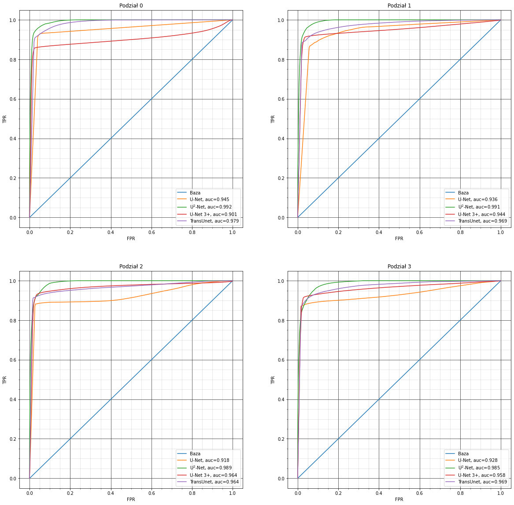
    


## 5.5. Mix on GE


```python
m_on_g = generate_metrics_matrix(mix_models, ge_images, ge_masks)
```

    WARNING:tensorflow:Collective ops is not configured at program startup. Some performance features may not be enabled.
    INFO:tensorflow:Using MirroredStrategy with devices ('/job:localhost/replica:0/task:0/device:GPU:0', '/job:localhost/replica:0/task:0/device:GPU:1', '/job:localhost/replica:0/task:0/device:GPU:2')
    loading model:  unet_2d
    loading model:  unet_2d
    loading model:  unet_2d
    loading model:  unet_2d
    WARNING:tensorflow:Collective ops is not configured at program startup. Some performance features may not be enabled.
    INFO:tensorflow:Using MirroredStrategy with devices ('/job:localhost/replica:0/task:0/device:GPU:0', '/job:localhost/replica:0/task:0/device:GPU:1', '/job:localhost/replica:0/task:0/device:GPU:2')
    loading model:  u2net_2d
    loading model:  u2net_2d
    loading model:  u2net_2d
    loading model:  u2net_2d
    WARNING:tensorflow:Collective ops is not configured at program startup. Some performance features may not be enabled.
    INFO:tensorflow:Using MirroredStrategy with devices ('/job:localhost/replica:0/task:0/device:GPU:0', '/job:localhost/replica:0/task:0/device:GPU:1', '/job:localhost/replica:0/task:0/device:GPU:2')
    loading model:  unet_3plus_2d
    loading model:  unet_3plus_2d
    loading model:  unet_3plus_2d
    loading model:  unet_3plus_2d
    WARNING:tensorflow:Collective ops is not configured at program startup. Some performance features may not be enabled.
    INFO:tensorflow:Using MirroredStrategy with devices ('/job:localhost/replica:0/task:0/device:GPU:0', '/job:localhost/replica:0/task:0/device:GPU:1', '/job:localhost/replica:0/task:0/device:GPU:2')
    loading model:  transunet_2d
    loading model:  transunet_2d
    loading model:  transunet_2d
    loading model:  transunet_2d


```python
generate_model_metrics_tab(m_on_g)
```

    Metryki             U-Net              U$^2$-Net          U-Net 3+           TransUnet
    ------------------  -----------------  -----------------  -----------------  -----------------
    Focal Tversky       0.386 +- 3.43e-02  0.333 +- 7.39e-03  0.364 +- 9.64e-03  0.322 +- 4.21e-03
    Dokładność          0.934 +- 9.97e-03  0.956 +- 2.28e-03  0.947 +- 2.25e-03  0.956 +- 1.94e-03
    Średnia dokładność  0.776 +- 2.42e-02  0.837 +- 8.81e-03  0.807 +- 9.20e-03  0.833 +- 7.65e-03
    Precyzja            0.568 +- 4.68e-02  0.691 +- 1.84e-02  0.631 +- 1.99e-02  0.681 +- 1.60e-02
    Czułość             0.814 +- 3.28e-02  0.812 +- 1.48e-02  0.803 +- 2.36e-02  0.831 +- 1.04e-02
    F1/Dice             0.666 +- 3.85e-02  0.745 +- 8.41e-03  0.705 +- 6.68e-03  0.748 +- 6.65e-03
    IoU                 0.504 +- 4.15e-02  0.594 +- 1.07e-02  0.544 +- 7.92e-03  0.598 +- 8.43e-03
    ROC AUC             0.895 +- 1.35e-02  0.969 +- 1.61e-03  0.897 +- 1.90e-02  0.933 +- 6.79e-03
    
    
    
    | Metryki            | U-Net             | U$^2$-Net         | U-Net 3+          | TransUnet         |
    |--------------------|-------------------|-------------------|-------------------|-------------------|
    | Focal Tversky      | 0.386 +- 3.43e-02 | 0.333 +- 7.39e-03 | 0.364 +- 9.64e-03 | 0.322 +- 4.21e-03 |
    | Dokładność         | 0.934 +- 9.97e-03 | 0.956 +- 2.28e-03 | 0.947 +- 2.25e-03 | 0.956 +- 1.94e-03 |
    | Średnia dokładność | 0.776 +- 2.42e-02 | 0.837 +- 8.81e-03 | 0.807 +- 9.20e-03 | 0.833 +- 7.65e-03 |
    | Precyzja           | 0.568 +- 4.68e-02 | 0.691 +- 1.84e-02 | 0.631 +- 1.99e-02 | 0.681 +- 1.60e-02 |
    | Czułość            | 0.814 +- 3.28e-02 | 0.812 +- 1.48e-02 | 0.803 +- 2.36e-02 | 0.831 +- 1.04e-02 |
    | F1/Dice            | 0.666 +- 3.85e-02 | 0.745 +- 8.41e-03 | 0.705 +- 6.68e-03 | 0.748 +- 6.65e-03 |
    | IoU                | 0.504 +- 4.15e-02 | 0.594 +- 1.07e-02 | 0.544 +- 7.92e-03 | 0.598 +- 8.43e-03 |
    | ROC AUC            | 0.895 +- 1.35e-02 | 0.969 +- 1.61e-03 | 0.897 +- 1.90e-02 | 0.933 +- 6.79e-03 |
    
    
    
    \begin{tabular}{lllll}
    \hline
     Metryki            & U-Net                         & U$^2$-Net                     & U-Net 3+                      & TransUnet                     \\
    \hline
     Focal Tversky      & \[0.386 \pm 3.43e\text{-}02\] & \[0.333 \pm 7.39e\text{-}03\] & \[0.364 \pm 9.64e\text{-}03\] & \[0.322 \pm 4.21e\text{-}03\] \\
     Dokładność         & \[0.934 \pm 9.97e\text{-}03\] & \[0.956 \pm 2.28e\text{-}03\] & \[0.947 \pm 2.25e\text{-}03\] & \[0.956 \pm 1.94e\text{-}03\] \\
     Średnia dokładność & \[0.776 \pm 2.42e\text{-}02\] & \[0.837 \pm 8.81e\text{-}03\] & \[0.807 \pm 9.20e\text{-}03\] & \[0.833 \pm 7.65e\text{-}03\] \\
     Precyzja           & \[0.568 \pm 4.68e\text{-}02\] & \[0.691 \pm 1.84e\text{-}02\] & \[0.631 \pm 1.99e\text{-}02\] & \[0.681 \pm 1.60e\text{-}02\] \\
     Czułość            & \[0.814 \pm 3.28e\text{-}02\] & \[0.812 \pm 1.48e\text{-}02\] & \[0.803 \pm 2.36e\text{-}02\] & \[0.831 \pm 1.04e\text{-}02\] \\
     F1/Dice            & \[0.666 \pm 3.85e\text{-}02\] & \[0.745 \pm 8.41e\text{-}03\] & \[0.705 \pm 6.68e\text{-}03\] & \[0.748 \pm 6.65e\text{-}03\] \\
     IoU                & \[0.504 \pm 4.15e\text{-}02\] & \[0.594 \pm 1.07e\text{-}02\] & \[0.544 \pm 7.92e\text{-}03\] & \[0.598 \pm 8.43e\text{-}03\] \\
     ROC AUC            & \[0.895 \pm 1.35e\text{-}02\] & \[0.969 \pm 1.61e\text{-}03\] & \[0.897 \pm 1.90e\text{-}02\] & \[0.933 \pm 6.79e\text{-}03\] \\
    \hline
    \end{tabular}


```python
print_metrics_plot(m_on_g)
```


    
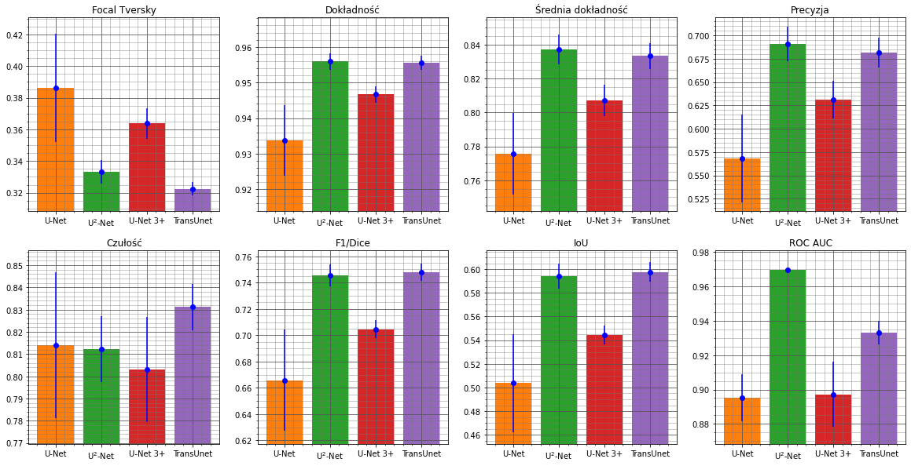
    


```python
plot_rocs(m_on_g, ge_masks)
```


    
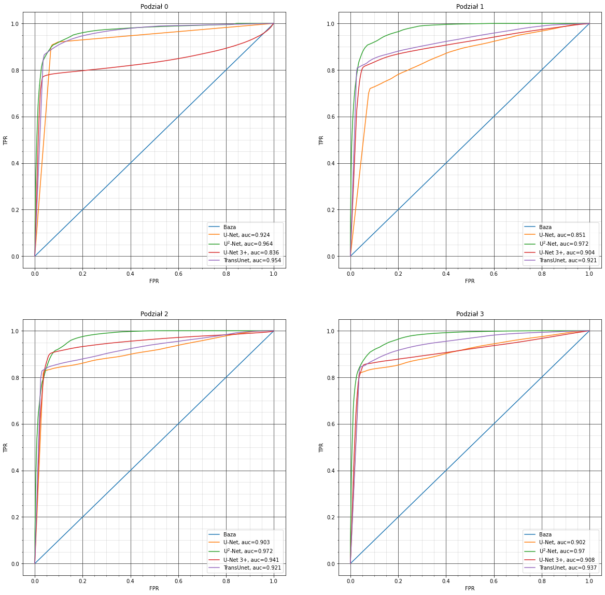
    


## 6. Generate images


```python
def plot_comparison(model_paths, image, mask, n=0):
    
    plt.figure(figsize=(25, 25))
    plt.subplot(1, 5, 1)
    plt.imshow(image)
    plt.imshow(mask, alpha=0.5, cmap=original_map)
    plt.title('Oryginał', fontsize=18)
    
    i=2
    for title, m_paths in model_paths.items():
        m_path = m_paths[0]
        gpus = tf.config.list_logical_devices('GPU')
        strategy = tf.distribute.MirroredStrategy(gpus)

        with strategy.scope():
            print('loading model: ', title)
            model = tf.keras.models.load_model(f'output/{m_path}model/model', custom_objects=custom_objects)
            prediction = model.predict(np.expand_dims(image, 0))[0]

        plt.subplot(1, 5, i)
        plt.imshow(image)
        plt.imshow(prediction, alpha=0.5, cmap=original_map)
        plt.title(title, fontsize=18)
        i += 1
    clear_output(wait=False)
    plt.show()
```

## 6.1. Samsung images


```python
def sorted_preditions(model_path, images, masks):
    
    model = tf.keras.models.load_model(model_path, custom_objects=custom_objects)
    
    for idx in range(8):
        start_index = idx*8
        end_index = start_index + 8
        sub_pred = model.predict(images[start_index:end_index])
        if idx == 0:
            predictions = sub_pred
        else:
            predictions = np.concatenate((predictions, sub_pred), axis=0)

    
    results = {}
    i = 0
    for mask, prediction in zip(masks, predictions):                
        # fpr, tpr, threshold = metrics.roc_curve(np.round(mask).astype(int).flatten(), prediction.flatten())
        # roc_auc = metrics.auc(fpr, tpr)
        
        loss_val = custom_focal_tversky(mask, prediction)
        
        results[i] = float(loss_val)
        i += 1
        
    # sort
    
    return dict(sorted(results.items(), key=lambda item: item[1]))
```


```python
sorted_preditions(f'output/unet_2d/samsung/320_nf4_fi0/model/model', samsung_images, samsung_masks)
```


    {40: 0.05651799961924553,
     59: 0.07564400881528854,
     14: 0.07830020040273666,
     11: 0.07949227094650269,
     51: 0.0928262397646904,
     2: 0.09361673146486282,
     20: 0.09396325796842575,
     16: 0.09406265616416931,
     50: 0.09714610129594803,
     3: 0.10998184233903885,
     56: 0.11734680086374283,
     38: 0.11768367141485214,
     63: 0.1251789629459381,
     0: 0.12565763294696808,
     6: 0.12985512614250183,
     12: 0.13515415787696838,
     21: 0.13814304769039154,
     25: 0.14334194362163544,
     55: 0.15354828536510468,
     32: 0.15890488028526306,
     19: 0.16188685595989227,
     9: 0.16928064823150635,
     34: 0.17097100615501404,
     62: 0.1743791550397873,
     13: 0.17584490776062012,
     31: 0.1770535260438919,
     44: 0.1790492832660675,
     39: 0.18677635490894318,
     29: 0.1913776397705078,
     46: 0.20272396504878998,
     49: 0.206844761967659,
     43: 0.2078780084848404,
     53: 0.2163737416267395,
     15: 0.23376113176345825,
     60: 0.2418477088212967,
     28: 0.25624966621398926,
     8: 0.26110967993736267,
     1: 0.2616005539894104,
     27: 0.27913257479667664,
     33: 0.28023263812065125,
     57: 0.2874007821083069,
     48: 0.28934988379478455,
     30: 0.30411434173583984,
     5: 0.307579904794693,
     41: 0.3348940312862396,
     52: 0.34837138652801514,
     24: 0.34894654154777527,
     54: 0.350656658411026,
     47: 0.3631698191165924,
     23: 0.43151772022247314,
     45: 0.4449124336242676,
     22: 0.44643470644950867,
     17: 0.4474221169948578,
     4: 0.45028582215309143,
     26: 0.4567738175392151,
     58: 0.4713134169578552,
     7: 0.5005659461021423,
     36: 0.5777779221534729,
     42: 0.605322003364563,
     35: 0.6242877244949341,
     10: 0.6720919013023376,
     37: 0.9932659268379211,
     18: 1.0,
     61: 1.0}


```python
sorted_preditions(f'output/unet_2d/samsung/320_nf4_fi0/model/model', samsung_images, samsung_masks)
```


    {37: 0.5603569810329514,
     18: 0.5670365185896047,
     42: 0.639348415803529,
     26: 0.8366897013027662,
     52: 0.8689431127108734,
     41: 0.8781182541738433,
     23: 0.8822812539042184,
     61: 0.8879056190338551,
     30: 0.8991537078252916,
     58: 0.8991578452444058,
     4: 0.9103467845952014,
     54: 0.920763075788664,
     10: 0.9246688254651696,
     57: 0.9389978640812894,
     5: 0.9392984941741078,
     1: 0.9422850961773683,
     45: 0.9423884154181841,
     28: 0.946238233406118,
     53: 0.9502634662842588,
     17: 0.9514425079434603,
     29: 0.9526538661773557,
     22: 0.9553223849866932,
     44: 0.9563023443844505,
     36: 0.9623787333513664,
     33: 0.9626719507970646,
     43: 0.963122917722352,
     27: 0.9669283171582154,
     7: 0.9696587123412809,
     48: 0.9719765783059942,
     24: 0.9739327918564982,
     25: 0.9761838652492106,
     49: 0.9764453695361022,
     35: 0.9792767870374944,
     60: 0.9799680623979148,
     39: 0.9808450093274064,
     47: 0.9817983585208516,
     38: 0.9822529176453385,
     19: 0.9828849606036607,
     9: 0.9835677270244625,
     51: 0.9847675796395079,
     2: 0.9857760783778274,
     20: 0.9869763267110889,
     31: 0.9872490545482373,
     55: 0.9874311148080283,
     16: 0.9876057704853775,
     50: 0.9883937336639379,
     6: 0.9887113409481685,
     46: 0.9910920152394268,
     21: 0.9911945719404538,
     8: 0.9916252064936737,
     32: 0.9918184917802881,
     62: 0.9921466753989292,
     14: 0.9950236970660077,
     34: 0.9958395320883778,
     13: 0.9968558393033018,
     63: 0.9976770906671422,
     59: 0.9980671194196817,
     3: 0.9980871684104763,
     12: 0.9986058802064158,
     15: 0.9989134282567652,
     0: 0.9991649286623251,
     11: 0.9993191824534842,
     40: 0.9993596634670935,
     56: 0.9994398645914482}


```python
# Example of great classsication

i = 40
# i = 56
best_samsung_image = samsung_images[i]
best_samsung_mask = samsung_masks[i]

plt.imshow(best_samsung_image)
plt.imshow(best_samsung_mask, alpha=0.5, cmap=original_map)
plt.title('Best', fontsize=15)
plt.show()

# Example of bad classsication
i = 36
worst_samsung_image = samsung_images[i]
worst_samsung_mask = samsung_masks[i]

plt.imshow(worst_samsung_image)
plt.imshow(worst_samsung_mask, alpha=0.5, cmap=original_map)
plt.title('Worst', fontsize=15)
plt.show()
```


    
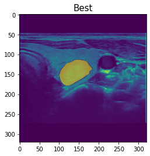
    


    
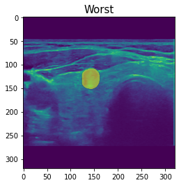
    


### 6.1.1 Samsung models

**Best**


```python
plot_comparison(samsung_models, best_samsung_image, best_samsung_mask)
```


    

    


**Worst**


```python
plot_comparison(samsung_models, worst_samsung_image, worst_samsung_mask)
```


    
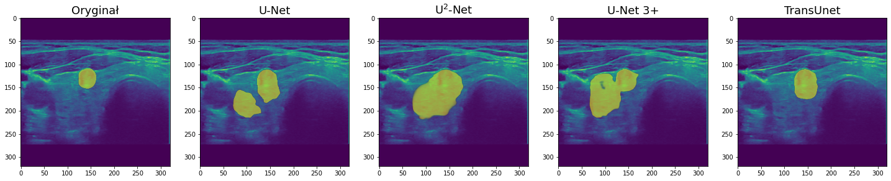
    


### 6.1.2 GE models

**Best**


```python
plot_comparison(ge_models, best_samsung_image, best_samsung_mask)
```


    

    


**Worst**


```python
plot_comparison(ge_models, worst_samsung_image, worst_samsung_mask)
```


    

    


### 6.1.3. Mix models

**Best**


```python
plot_comparison(mix_models, best_samsung_image, best_samsung_mask)
```


    
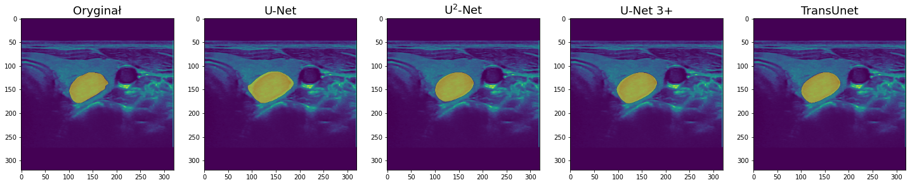
    


**Worst**


```python
plot_comparison(mix_models, worst_samsung_image, worst_samsung_mask)
```


    
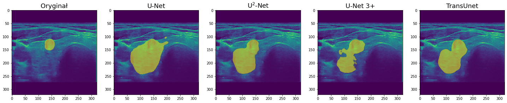
    


## 6.2. GE images


```python
sorted_preditions(f'output/unet_2d/ge/320_nf4_fi0/model/model', ge_images, ge_masks)
```


    {3: 0.13676995038986206,
     48: 0.1777196228504181,
     14: 0.18819835782051086,
     13: 0.19280008971691132,
     42: 0.1966375708580017,
     59: 0.19921357929706573,
     19: 0.20281778275966644,
     54: 0.21240046620368958,
     18: 0.22323110699653625,
     20: 0.22517606616020203,
     32: 0.23903793096542358,
     33: 0.2564735412597656,
     28: 0.25986236333847046,
     37: 0.26713821291923523,
     5: 0.27671948075294495,
     10: 0.2839130461215973,
     4: 0.2878805994987488,
     49: 0.29235899448394775,
     36: 0.29401320219039917,
     62: 0.29937827587127686,
     16: 0.30058079957962036,
     50: 0.33894893527030945,
     47: 0.34196770191192627,
     55: 0.3907183110713959,
     60: 0.4092894196510315,
     0: 0.42673760652542114,
     40: 0.4515014588832855,
     26: 0.4515891671180725,
     17: 0.4549015164375305,
     29: 0.4803597331047058,
     31: 0.4837532937526703,
     35: 0.4860038161277771,
     23: 0.4967321455478668,
     8: 0.5016116499900818,
     57: 0.5150437355041504,
     24: 0.5150967240333557,
     7: 0.5210011601448059,
     9: 0.5257576704025269,
     51: 0.5302814245223999,
     63: 0.5355304479598999,
     30: 0.551520049571991,
     43: 0.5600525140762329,
     34: 0.5619373917579651,
     6: 0.575088381767273,
     44: 0.5753273367881775,
     46: 0.5822636485099792,
     11: 0.5991522669792175,
     53: 0.6118340492248535,
     52: 0.6158743500709534,
     12: 0.6405649781227112,
     45: 0.6422280073165894,
     61: 0.6445956826210022,
     56: 0.7060999870300293,
     41: 0.7143675684928894,
     39: 0.7149157524108887,
     58: 0.727173924446106,
     21: 0.7407923936843872,
     27: 0.8647834658622742,
     15: 0.9167611002922058,
     22: 0.9999997019767761,
     25: 0.9999997019767761,
     1: 0.9999997615814209,
     2: 0.9999998807907104,
     38: 1.0}


```python
# Example of great classsication
i = 3
best_ge_image = ge_images[i]
best_ge_mask = ge_masks[i]

plt.imshow(best_ge_image)
plt.imshow(best_ge_mask, alpha=0.5, cmap=original_map)
plt.title('Best', fontsize=15)
plt.show()

# Example of bad classsication
i = 58
worst_ge_image = ge_images[i]
worst_ge_mask = ge_masks[i]

plt.imshow(worst_ge_image)
plt.imshow(worst_ge_mask, alpha=0.5, cmap=original_map)
plt.title('Worst', fontsize=15)
plt.show()
```


    
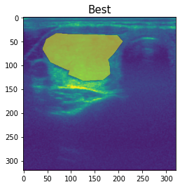
    


    

    


### 6.2.1. GE models

**Best**


```python
plot_comparison(ge_models, best_ge_image, best_ge_mask)
```


    
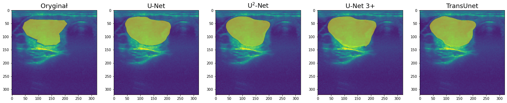
    


**Worst**


```python
plot_comparison(ge_models, worst_ge_image, worst_ge_mask)
```


    

    


### 6.2.2. Samsung models

**Best**


```python
plot_comparison(samsung_models, best_ge_image, best_ge_mask)
```


    
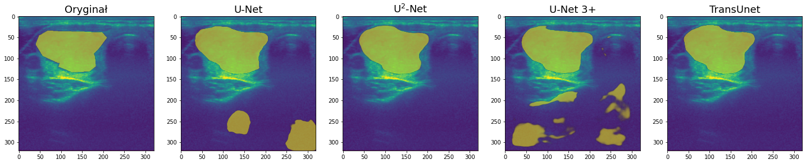
    


**Worst**


```python
plot_comparison(samsung_models, worst_ge_image, worst_ge_mask)
```


    

    


### 6.1.3. Mix models

**Best**


```python
plot_comparison(mix_models, best_ge_image, best_ge_mask)
```


    
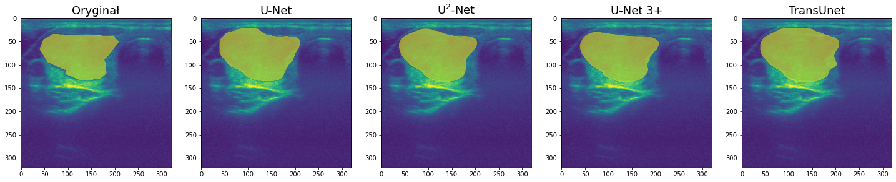
    


**Worst**


```python
plot_comparison(mix_models, worst_ge_image, worst_ge_mask)
```


    

    

